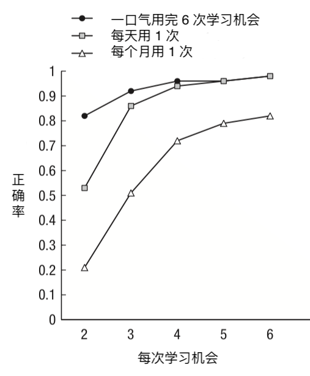
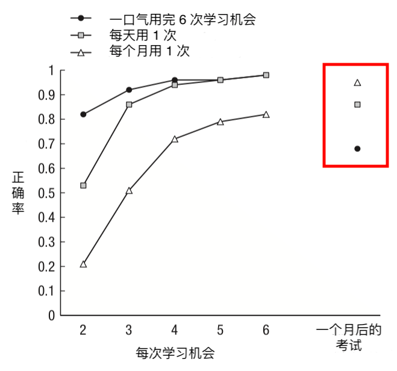
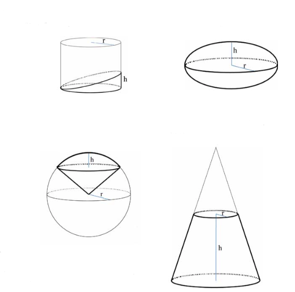
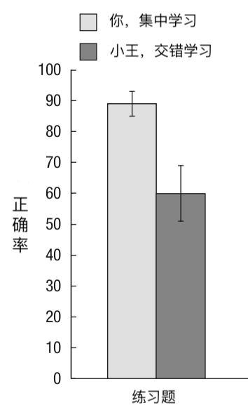
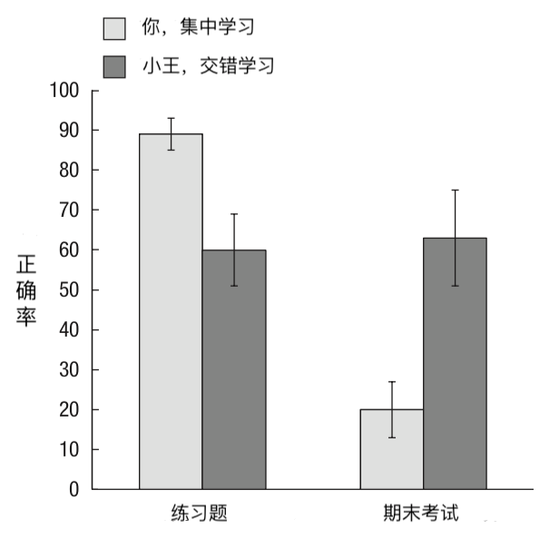
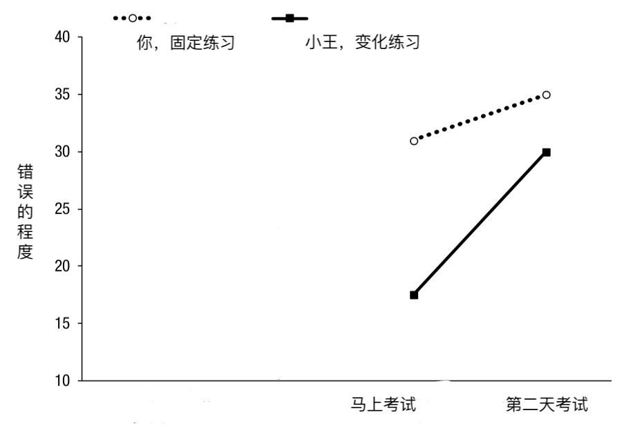
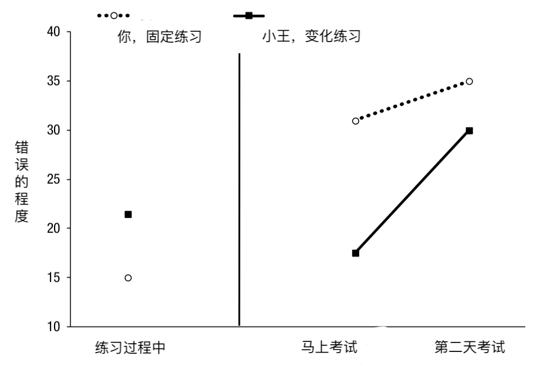
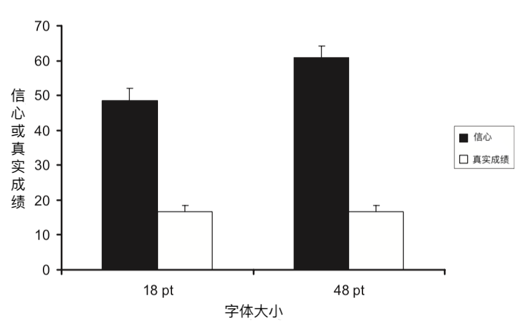
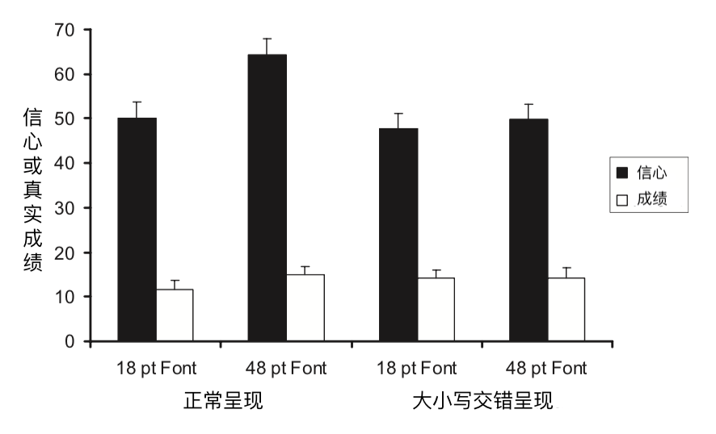

本文要介绍一类学习方法，它们能让你记忆更持久，学习效果更好。它们有大量的研究支持，适用面广，不需要你花钱去培训班就可以上手。这类方法下面有很多个变种，表现形式不同，但核心相似。我们先通过下面的实验来认识其中一种。

## 背单词实验

这项实验发表于 1979 年，实验流程简化一下是这样的：[^1]

科学家找到了你，你的朋友天天和月月一起来背单词。

单词以「中文-英文」这样的形式出现，比如：

1. 苹果-Apple
2. 狗-Dog
3. ……

你们每个人有六次学习机会。第一次的时候，你会先学一遍所有单词；从第二次开始，每次科学家都会先考考你，记录你记住了多少单词，然后把你没记住的拿出来让你记，然后再考，再把你没记住的拿出来让你记，直到你记住所有单词。

你们的区别在于如何安排这六次学习机会：

1. 你，一口气用完这六次学习机会；
2. 天天，每天用一次，也就是说今天学一遍，明天学一遍……直到用完六次；
3. 月月，每个月用一次，也就是说这个月学一遍，下个月再学一遍……直到用完六次。

你猜哪种学习方法的记忆效果最好？

实验结果如下：[^2]

前面说了，从第二次学习开始，科学家都会先让你们回忆一下，看看记住了多少单词。每次回忆的成绩都记在上面这张图上。小圆圈代表的是你的成绩，你一口气用完六次学习机会；小方形是天天的成绩，她每天用一次；小三角是月月的成绩，她每个月用一次。在图上的位置越高说明回忆的正确率越高。

很明显，你成绩最好；天天一开始比你差一些，但后来就差不多了；而月月则比你们差多了。

所以，一口气用完六次学习机会的学习方法记忆效果最好，而时间间隔越长，记忆效果就越差。这貌似也很容易理解，毕竟隔一个月再学，东西早忘了，记忆效果肯定不

慢着……

科学家其实还安排了一场期末考试，时间就在每个人用完所有六次学习机会的一个月后。也就是说，科学家让大家都隔了很久再来考试，看看哪种学习方法更好。

结果如下：

注意上图右上角红框内的三个点。谁的成绩最好？是月月；谁的成绩最差？是你。期末考试的时候，剧情反转了。

所以，从长期效果来看，时间间隔越长，学习效果反而越好。

这个实验就引出了我们要说的第一种记忆方法或学习方法：

## 分散练习

分散练习指的是，你学一个东西，可能得记它个好几遍，或者练习个好几遍才能掌握。那么你不要集中一下子练好几遍，而是要分开，间隔一段时间练习一下，这样学习效果更好。

分散练习可以用来学很多东西。除了上面实验中的记单词，还可以用来记事实、文本、图片等等。就记东西来说，有心理学家总结了 254 项研究，这些研究涉及的总人数达上万人，结果发现分散练习的学习效果显著高于集中练习。[^3] 除了记东西，分散练习也可以用来学习身体技能，比如羽毛球、棒球、篮球、钢琴、电脑游戏等等，学习效果也都好于集中练习。

## 交错练习

分散练习有个兄弟，叫交错练习。它指的是，如果你同时在学多个东西，不要一口气学一个，然后再学一个。而是要交错开来，学一下 A，再学一下 B，再学一下 A，又学一下 B……

关于交错练习，我们来看一项 2007 年的研究：[^4]

科学家叫你和小王来学习几何。你们要学习下面四种几何图形体积计算方式：

针对每个图形，科学家都会给你们一份教材，和四道练习题。一共就是四份教材，16 道练习题。每做完一题，科学家都会给你看一会正确答案。

你和小王的区别是：

你，先给你一份教材，然后给你四道配套的练习；然后再给你一份另一个图形的教材，然后四道配套的题……你是集中学习一个图形，然后再学习一个。

小王，先连续给四份教材，然后题目交错着给，比如先给第一个图形的一道题，然后是第二个图形的一道题，然后是第三个图形的一道题，然后第四个图形一道题，然后又是第一个图形一道题……小王是交错着学习四种图形。

所有的练习题，科学家都记录了你们的答案，统计了正确率：

很明显，你的正确率更高。也就是集中学一个图形再学一个图形这种学习方法效果更好。

当然啦，肯定没有结束。心机 boy 科学家在一周后安排了一场期末考试，每个图形都给你们出了两道没做过的题。结果发现：

小王期末考试的成绩比你好耶！熟悉的配方，熟悉的味道。

所以，从长远效果来看，交错学习的学习效果好于集中学习。

## 好办法没人用

分散练习，交错练习，科学家都说好。可是讽刺的是，人们往往更容易选择那些更低效的学习方法。2011 年发表的一项调查中，93.33% 的大学生认为集中练习，而不是分散练习效果更好！[^5]

为什么？我们也看到了，在学习阶段，或者短期来看，集中练习往往比分散练习和交错练习有更好的学习效果。虽然这种效果只是暂时的，并不长久，但很有诱惑性。我们相信我们的感觉，然后做出了不理性的选择。

一会再回到这个问题，先接着再看一种学习方法。

## 丢沙包实验

还是先来看一个 1978 年的经典实验。[^6]

科学家找到你和小王来丢沙包。最终会有一个考试，需要你们在 1.5 米外用沙包击中目标。

但是科学家给你和小王安排了不同的练习方法：

1. 你，就在 1.5 米外练习丢沙包。
2. 小王，只在 1 米或 2 米外练习。

你觉得谁在最终的考试中命中率更高？

考试的时候，距离是 1.5 米，而你在练习的时候也是这个距离，所以你的训练方式更有针对性，你稳操胜券。

但最终的人生赢家却是小王！

也就是说，变化更丰富的训练方式反而比有针对性的方式效果更好。这就引出了我们要说学习方法：

## 变化练习

变化练习指的是，你学习的时候可以改变一些学习过程中的参数，这样学习效果更好。

有时候你做的改变可能看上去微不足道，但却可能带来很好的效果。我们来看一个背单词的实验：[^7]

科学家找到你和小王来背单词。一共 40 个单词，你们先背一遍，三小时后再背一遍。

你和小王的区别是：

1. 你，两次都在同一个房间背单词。
2. 小王，第一遍在一个房间，第二遍去了另一个房间。

又三小时后之后，科学家让你们去了一个全新的房间考试，看你们记住了多少。结果发现：

小王的成绩比你高了 21%！

这里的变化练习所改变的只是你背单词的环境而已。你可能觉得这个结果太诡异了，只是运气成分。可是后续有多个研究重复发现了类似的现象。比如在 1984 年一项研究中，你和小王要学的是比单词更复杂的统计学概念，变化环境同样促进了学习效果。[^8]

在健身领域，变化练习是一个非常重要非常基本的原则。比如你要健美，或者想增加力量，那么一定程度上改变重量的范围，组间休息的长度，动作的选择，动作的顺序，训练的频率，训练的组数……可以帮助你获得更好的健身效果，以及突破瓶颈。[^9]

## 短期效果与长期效果

我们一开始介绍的两种学习方法，它们都有一个特点：短期效果不好，练的时候错误百出，但是长期效果却很好，能让记忆或学习成果保持得更持久。

变化练习也有这个特点。我们来看一个 1977 年的相关实验：[^10]

科学家叫你和小王来做游戏。你们坐在椅子上，面前会出现障碍物，你们要把障碍物推倒，而且时间要控制在 200 毫秒。

你和小王先接受训练，区别是：

1. 你，无趣直男，障碍物每次都出现在你面前 60 厘米处。
2. 小王，花样美男，障碍物出现在 15、35、60、65 厘米四种距离处。

很明显，小王采用的是变化练习的思路。科学家安排了两场考试，一场是训练后马上考，一场是第二天考。考试的距离是 50 厘米。注意，你们谁都没练过 50 厘米的距离，相当于是一个全新的考试题型。

结果，不管是马上考，还是第二天考，小王的成绩都比你好：

上图中，点越高说明错误越多。所以小王的成绩（黑点）更好。

但是在练习的过程中，你的表现却比小王好：

这个特点很容易让人们对这些有效的学习方法留下不好的第一印象，而不愿意使用它们。这是学习中非常常见的误区：凭习惯和感受决定学习方法。下文将揭示，这个误区有多不靠谱，会让人做出多么低效的决策。

## 字体实验

我们先来看一项发表于 2008 年的研究。[^11] 这项研究包含好几个层层递进的实验，看完之后你就会意识人们是多么容易凭感觉下判断，而这又是多么不靠谱。

第一个实验大概是这样的：科学家找来一群大学生，给他们看单词。每呈现一个单词，科学家就会让大学生打个分，用这个分数来表示自己有多大的信心在之后回忆出这个单词。分数范围从 0 到 100，越高表示越有信心回忆出来。呈现完之后，科学家会让大学生回忆这些单词，并记录成绩。

实验逻辑就是这么简单。有意思的是，这些单词有一部分用大字体呈现，一部分用小字体呈现。字体大小会有什么影响吗？结果见下图：

黑色柱子表示学生的信心，从图上可以看出，学生对大字体呈现的单词更有信心，认为自己之后更能回忆出这些单词。白色柱子表示学生的真实成绩，可以看出，不管用大字体还是小字体呈现，学生的真实成绩并没有显著区别！

也就是说，学生在判断自己的记忆成绩时，受到了字体大小的影响，而字体大小对成绩其实没有半毛钱的影响。

更有意思的是，在后续的一个实验中，科学家明确！两次！提醒学生，字体大小并不会影响他们的记忆成绩，让他们将注意力集中在单词本身。结果还是出现了第一个实验的情况：学生的信心受字体大小的影响，而实际成绩和字体大小无关。而且这一次，科学家专门让学生做了问卷，问他们单词大小有没有影响他们的判断。有一些学生认为有，有一些学生认为没有，但这两波学生的打分都表明，不管他们自己怎么认为，字体大小都影响了他们的判断！

## 误导人的「流畅感」

为什么会出现这种情况？研究者认为，大字体呈现的单词给学生一种清晰流畅的主观感受，这种流畅感误导了学生的判断。

在又一个后续实验中，科学家又做了一点手脚，他们将一些单词以大小写交错的形式呈现。比如将「piano」呈现为「PiAnO」。当这么呈现的时候，不管是大字体还是小字体，学生都没法产生清晰流畅的主观感受，看着都很费劲。这时候，字体大小对学生的信心就不再产生影响。见下图：

注意最右边的两个黑柱子，分别是用小字体和大字体呈现大小写交错的单词，两个柱子高度没有显著差别。而不管是正常呈现还是大小写交错，不管是大字体还是小字体，学生的真实成绩都差不多。

这样的研究还有不少。有研究发现，当用更大的声音呈现时，学生会觉得自己记得更牢，其实没有毛线关系；[^12] 在另一个研究中，科学家不光改变单词的字体大小，还会告诉被试有的单词会呈现一次，有的会呈现两次，结果发现字体大小影响被试的判断，呈现一次还是两次并没有影响被试的判断，但是你理性想一想，明显是呈现的次数更影响记忆的成绩啊；[^13] 更有研究发现，当以不清晰、看着费劲的字体呈现时（见下图中上方的字体），真实的记忆成绩反而还更好，因为这会让学生加工得更深入。[^14]

## 爽不一定好

相比于看着费劲，流畅感是一种更爽的感觉。大部分人更喜欢学习的时候行云流水一气呵成，而不是磕磕盼盼。但学得爽，未必学得好。如果你以学得爽不爽做为指标，很可能对自己的学习状态做出误判，或者做出错误的决策。

本文章介绍了几种科学有效的学习方法，但这些方法都不太爽，通常是人们下意识会避免使用的方法。比如复习的时候，人们非常喜欢用的学习方法是——再读一遍。单词忘了，拿出单词本，再背一遍；概念生疏了，拿出物理书，把相关章节再学一遍。而更高效的学习方法是，不要急着翻书，绞尽脑汁先想一想，回忆一下。大量的研究表明这种考考自己的方法优于再读一遍，会让你记得更长久。见我[另一篇文章](/cn/does-memory-training-work/)。但是调查发现，学生们更相信低效的方法。[^5] 为什么？因为爽。再读一遍的费劲程度远远比不上考考自己，整个过程也更流畅，而考考自己也很容易发现错误，让人又费劲又不痛快。

说到错误，避免犯错也是人们获得爽感的一种方式。而我[另一篇文章](/cn/learn-from-errors/)介绍过，避免错误一定程度上也在削弱学习效果。

遵从习惯某种程度上也是一种爽的方式，因为可以避免思考，但并不一定意味着高效。比如人们会倾向于按从左到右或从上到下的顺序学习，而不是更高效地聚集于最难或最容易的部分。[^15]

总之，好的学习方法往往有点反直觉，它们很难通过习惯或主观感受获得，需要专门学习。

[^1]: Bahrick, H. P. (1979). Maintenance of knowledge: Questions about memory we forgot to ask. Journal of Experimental Psychology: General, 108(3), 296–308. https://doi.org/10.1037/0096-3445.108.3.296

[^2]: Dunlosky, J., Rawson, K. A., Marsh, E. J., Nathan, M. J., & Willingham, D. T. (2013). Improving Students’ Learning With Effective Learning Techniques Promising Directions From Cognitive and Educational Psychology. Psychological Science in the Public Interest, 14(1), 4–58. https://doi.org/10.1177/1529100612453266

[^3]: Cepeda, N. J., Pashler, H., Vul, E., Wixted, J. T., & Rohrer, D. (2006). Distributed practice in verbal recall tasks: A review and quantitative synthesis. Psychological Bulletin, 132(3), 354–380. https://doi.org/10.1037/0033-2909.132.3.354

[^4]: Rohrer, D., & Taylor, K. (2007). The shuffling of mathematics problems improves learning. Instructional Science, 35(6), 481–498. https://doi.org/10.1007/s11251-007-9015-8

[^5]: McCabe, J. (2011). Metacognitive awareness of learning strategies in undergraduates. Memory & Cognition, 39(3), 462–476. https://doi.org/10.3758/s13421-010-0035-2

[^6]: Kerr, R., & Booth, B. (1978). Specific and Varied Practice of Motor Skill. Perceptual and Motor Skills, 46(2), 395–401. https://doi.org/10.1177/003151257804600201

[^7]: Smith, S. M., Glenberg, A., & Bjork, R. A. (1978). Environmental context and human memory. Memory & Cognition, 6(4), 342–353. https://doi.org/10.3758/BF03197465

[^8]: Smith, S. M., & Rothkopf, E. Z. (1984). Contextual Enrichment and Distribution of Practice in the Classroom. Cognition and Instruction, 1(3), 341–358. https://doi.org/10.1207/s1532690xci0103_4

[^9]: Bompa, T. O., Buzzichelli, C., & Bompa, T. (2018). Periodization: Theory and Methodology of Training (6th ed. edition). Champaign, IL: Human Kinetics.

[^10]: McCracken, H. D., & Stelmach, G. E. (1977). A Test of the Schema Theory of Discrete Motor Learning. Journal of Motor Behavior, 9(3), 193–201. https://doi.org/10.1080/00222895.1977.10735109

[^11]: Rhodes, M. G., & Castel, A. D. (2008). Memory predictions are influenced by perceptual information: Evidence for metacognitive illusions. Journal of Experimental Psychology: General, 137(4), 615–625. https://doi.org/10.1037/a0013684

[^12]: Rhodes, M. G., & Castel, A. D. (2009). Metacognitive illusions for auditory information: Effects on monitoring and control. Psychonomic Bulletin & Review, 16(3), 550–554. https://doi.org/10.3758/PBR.16.3.550

[^13]: Kornell, N., Rhodes, M. G., Castel, A. D., & Tauber, S. K. (2011). The Ease-of-Processing Heuristic and the Stability Bias: Dissociating Memory, Memory Beliefs, and Memory Judgments. Psychological Science, 22(6), 787–794. https://doi.org/10.1177/0956797611407929

[^14]: Diemand-Yauman, C., Oppenheimer, D. M., & Vaughan, E. B. (2011). Fortune favors the bold (and the italicized): Effects of disfluency on educational outcomes. Cognition, 118(1), 111–115. https://doi.org/10.1016/j.cognition.2010.09.012

[^15]: Dunlosky, J., & Ariel, R. (2011). The influence of agenda-based and habitual processes on item selection during study. Journal of Experimental Psychology: Learning, Memory, and Cognition, 37(4), 899–912. https://doi.org/10.1037/a0023064
