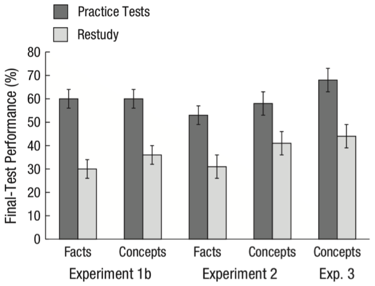

简单地说，有用。

但是记忆训练或者记忆策略并不只有单一的一种，本文将要探讨三类，这三类记忆训练侧重点并不相同：

1. 第一类让你记得更「快」。
2. 第二类让你记得更「多」。
3. 第三类让你记得更「久」。

而这三类记忆训练的效果也各不相同：

1. 第一类暂时缺乏有力的证据证明其有用。
2. 第二类有用，但是效果的范围有限。
3. 第三类有用，但是效果的程度有限。

## 第一类记忆训练：记得更快

简单粗暴地打个比方：记住东西的过程就像工厂生产产品。记忆工厂接收的原料是生活中的发生的事情，书本上看到的信息，身体产生的感觉，等等。最终的产品则是你脑中存储的记忆，比如新同事的名字，去新开的餐馆的路线，驾驶技能，等等。

你的大脑中记忆产品数量庞大，种类丰富，但是这是工厂长时间积累出来的，工厂的效率其实并不高。也就是说，你记东西的过程其实并不快。

比如下面有几个数字：

1，9，8

你看一眼就可以记住。

但是如果多给你几个：

0，2，5，9，2，3，7，8，1，4，5，6，7，2，9，4，5，6，2，8，2

你看十八眼未必记得住。如果我再让你把这些数倒着复述出来，难度就会更大，你的工厂一下子操作不过来。

同时将多个东西放在脑海中，然后操作它们，这在心理学上称为**工作记忆**（working memory）。工作记忆很像是电脑的内存，越大越好，越大你就能越快加工信息。而相比于大脑中存储的浩瀚的记忆，工作记忆其实小得可怜。

那接下来你就会很自然地发出灵魂一问：能不能增大工作记忆？

有这样的训练，这类训练在心理学里统称为**认知训练**（cognitive training）。认知训练的基本思路是，大脑的各种能力就像肌肉，重复的训练可以提高相应的能力，就像举铁练肌肉一样。比如让你记数字，通过不断的练习你能记住越来越多的数字，而这背后是你工作记忆的增强。

认知训练有很多形式，比如下面这个游戏：

上方符号通过隧道之后会丢失一个，需要你选出丢失的是哪一个。随着难度的增加，符号总数会增加。很明显，这个游戏会用到你的工作记忆。

这样的训练一百多年前就有人研究和推广了，只是当时这种训练对大众来说充满神秘色彩，居然和蛇油这类东西一起贩卖[^1]。最近几年，这个话题又再度火起来，在心理学领域火，在教育市场上也火，而且也争议不断。2014 年，国际上一波科学家，超过 70 人，联名写了一封公开信，质疑认知训练的效果。几个月后，另一波包括 133 名科学家和相应的从业者的团体又联名反驳，说有大量证据证明认知训练有效[^2]。

认知训练到底有没有用？目前的结论是，**没有充分的证据支持认知训练真正有效**[^2]。具体到训练工作记忆的认知训练，结论也一样[^3]。

什么叫「真正有效」？比如你练肌肉，你会很自然地认为你用杠铃练得的肌肉不仅可以用来举杠铃，也可以用来扛水，可以用来搬书柜。你不会认为你用杠铃练得的肌肉只能举杠铃。也就是说，举杠铃锻炼的不光光是举杠铃，而是肌肉，或者说是你操作重物的能力。回到认知训练，你要增强工作记忆，你花了钱下了一个 APP，你通过练习在 APP 里的表现不断提高，但你不希望这个效果只局限于这个 APP，你希望在真实的生活中你能更快地加工信息，你能一下记住更多数字，等等。

而认知训练现有的证据不足以支持认知训练能带来这样的效果。你通过不断练习，的确可以在练习本身上更厉害，但是换一个差异很大的任务，你就不行了，虽然这个任务需要的也是工作记忆。这就好比，你举杠铃之后，举杠铃的能力增加了，举哑铃的能力也增加了，仅此而已。你搬书柜的能力？I‘m sorry，暂时没办法通过让你举杠铃来锻炼你搬书柜的能力。

## 第二类记忆训练：记得更多

电脑的内存小是小，但我们可以优化软件。通过软件层面的办法可以一定程度突破内存的局限。我们下面要讨论的训练就像是软件层面的办法。

还是举个例子先：

d，a，l，a，o，h，u，c，h，i，x，i，a，o，m，i，m，i

抱歉，我又丢给你了一大串羞辱人类工作记忆的信息。但是别急着哭泣，我们来动点手脚：

da lao hu chi xiao mi mi

再动点手脚：

大老虎吃小咪咪

当你知道原先那一大串字母原来是这个意思，你就可以很快记住它们了。

帮你记得更多的这类记忆训练的核心就是这么简单，这么无趣。但是换个例子，你会发现这种方法效果惊人。

著名心理学家 Ericsson 做过一个实验[^4]：他找来一个大学生，让他不断练习一个游戏：以每秒一个数字的速度向这位大学生随机读数字（0 到 9 之间），停止的时候，大学生需要把这些数字复述出来。练习的频率大概每周两三次，每次一个小时。最开始的时候，这个大学生只能记住 7 个数字——正常人也差不多就是这个水平。但是当练了 200 次之后，他能记住 82 个数字！这几乎是正常人的 10 倍多。

他是怎么做到的？他并不是机械地不断重复实验任务——和上面说的练肌肉并不像。在练习的过程中，他想办法将几个数字归到一组，并给这组数字赋予意义。比如「418」这串数字可以想成「4 分 18 秒」（这位大学生是长跑爱好者）。他的方法不断改进，记忆的数字也越来越多。这种将数字赋予意义的思路正是他的办法的核心。

这类训练方法被统称为**记忆术**（mnemonics）。它就像给柔弱的你一套钢铁侠套装来帮助你打败怪兽。但是脱了套装，你还是你。记忆术虽然有时效果惊人，但它对你的内存其实无能无力，只能改进你的软件。

记忆术作为一种思路或者方法论，可以给我们很多启发。而它的问题在于，**它的效果会受记忆对象的限制**。什么意思？前面说到的那位大学生能记住 82 个数字，但是如果把数字换成字母，他的水平则和普通人无异。很多记忆大师的超级记忆都存在这种限制[^5]，比如记图形厉害但记字母就普通人水平。这就好比，你拳击很厉害不意味着你腿法也很牛。

记忆术在教育市场上也很火。大家花钱上课之前可以综合考虑其好处和限制。

## 第三类记忆训练：记得更久

你下了一部好电影，放在移动硬盘的层层文件夹下，希望时不时拿出来赏析，结果一个月后硬盘读不出来了。问，你是一个什么心情？

所谓记得久指的是，你不光能记住东西，而且在之后很长一段时间内也能回忆出来。如果记了东西很快就忘了，你记得再快再多也没什么鸟用。

严格来讲，这部分要说的算不上是一种记忆训练，它不像上面两种需要你专门去练。这里要说的更像是一种学习方法，你只要按照这种方法去学习或者记东西，就能记得更久。这种方法有广泛的研究支持，适用面很广，但是效果比较朴素，不会动不动提高内存或者一记一大堆。

这种方法的历史更久了，起码你小时候就用过，比如「考试」就是。

心理学研究发现，考一考自己其实是一种非常有效的学习方法，可以让你记得更久。很多人在学习的时候喜欢用「多看几遍」这种方法，但是其效果并不如考一考自己。看下面这个实验[^6]：

实验人员给一些学生看了一篇科普文。之后其中一半的人会再看一遍，而另一半的人需要回答一些关于这篇文章的小问题，相当于是小考试。一周之后，实验人员又叫来这些学生，让他们回答一些和上周读过的这篇文章有关的问题。有的问题的答案可以直接从文章中找到，而有的问题没有直接的答案，需要这些学生应用文章里的知识点（比如文章中提到了翅膀的知识，而问题是关于如何制造一种飞行器）。实验结果如下：

深色柱子表示使用考试方法的学生，浅色的柱子表示学了两遍的学生。柱子越高表示正确率越高。可以发现，深色的柱子更高，也就是读了一遍文章然后考了考自己的学生在一周后回答问题的正确率更高。而且心理学家做了不止一次实验，出的题目也不止一种类型，但是每次都是采用考试方法的学生回答的正确率高。

这样的实验心理学家做过很多次，不管是大人小孩，不管是背单词还是学物理，结果都是考试的学习方法好于多学几遍。

考试只是这类方法中的一种。**这类方法的核心是增大你学习过程中加工的深度**。比如再看一遍文章其实非常被动，你主观上也感觉更轻松，但是考自己需要你努力去回忆学过的东西，这个过程需要你更深入地加工信息，主观感受也更累。这是这类学习方法有效的原因，也是你讨厌这类方法的原因。

我之后会专门发文章探讨学习方法，会更深入涉及这个话题。

[^1]: Katz, B., Shah, P., & Meyer, D. E. (2018). How to play 20 questions with nature and lose: Reflections on 100 years of brain-training research. Proceedings of the National Academy of Sciences, 115(40), 9897–9904. http://doi.org/10.1073/pnas.1617102114
[^2]: Simons, D. J., Boot, W. R., Charness, N., Gathercole, S. E., Chabris, C. F., Hambrick, D. Z., & Stine-Morrow, E. A. (2016). Do “Brain-Training” Programs Work? Psychological Science in the Public Interest, 17(3), 103–186. Retrieved from http://psi.sagepub.com/content/17/3/103.abstract
[^3]: Melby-Lervåg, M., Redick, T. S., & Hulme, C. (2016). Working Memory Training Does Not Improve Performance on Measures of Intelligence or Other Measures of “Far Transfer” Evidence From a Meta-Analytic Review. Perspectives on Psychological Science, 11(4), 512–534. http://doi.org/10.1177/1745691616635612
[^4]: Ericsson, A., & Pool, R. (2016). Peak: Secrets from the new science of expertise. Houghton Mifflin Harcourt.
[^5]: Anders, K. (1985). Memory skill. Canadian Journal of Psychology/Revue Canadienne de Psychologie, 39(2), 188–231. http://doi.org/10.1037/h0080059
[^6]: Dunlosky, J., Rawson, K. A., Marsh, E. J., Nathan, M. J., & Willingham, D. T. (2013). Improving Students’ Learning With Effective Learning Techniques Promising Directions From Cognitive and Educational Psychology. Psychological Science in the Public Interest, 14(1), 4–58. http://doi.org/10.1177/1529100612453266
