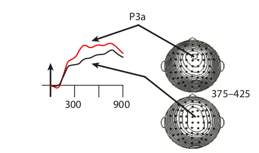
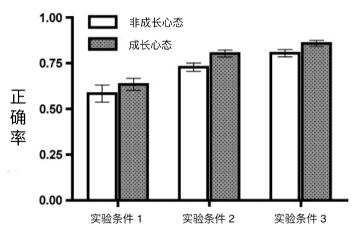

错误这种东西通常以反面形象出现，难让人喜欢。人们谈到学习中的错误时，也往往是说，要避免错误，或是改正错误。这里透露的信息是，错误是不好的，最好能从学习中去掉。错误这么不受待见，可能有两方面的原因：

第一，错误对学习效果有消极的影响。比如学钢琴时，你要是养成了错误的弹琴手势，演奏效果就会受影响。而且之后要改也会很麻烦，得花去不必要的时间精力。所以不如一开始就小心翼翼，避免犯错。

第二，错误给人的感受不好，让人不痛快。比如错误会让学习的过程变得磕磕绊绊，一点都不顺畅，而人们通常更喜欢一气呵成、行云流水的感觉；又比如总是犯错会让人觉得自己笨，怀疑智商，怀疑人生。所以不如尽量少犯错，让学习过程更开心愉悦。

这两点一个关乎「效果」，一个关乎「感受」。实际上，错误与这两点的关系并没有那么简单，本文将从心理学的角度来谈一谈。

## 错误对学习效果的消极影响

上文提到，如果错误养成习惯，改起来就会很麻烦，得花费本不必要的时间精力。关于这一点，心理学中的确有很多证据。

七十年代，美国两位心理学家就做过一个实验，实验流程简化一下大概是这样的：[^1]

你坐在电脑屏幕前，屏幕上会出现一些字母。这些字母可能来自「好字母组」，比如 B、C、D、F 等等；也可能来自「坏字母组」，比如 Q、R、S、T 等等。当屏幕上出现好字母的时候，你需要按下空格键。

心理学家就让你不断练习上面这个流程。一开始你肯定总是出错，但是越练就越熟练。练了上千次之后，技法已经炉火纯青。

在这个时候，心理学家告诉你，实验进入了第二阶段。别的都一样，只是当屏幕上出现坏字母的时候，你才按下空格键。注意，第一阶段是看到好字母才按键的，所以第二阶段练习的技能和第一阶段正好相反。

这时候你发现自己本来很熟练的技法回到了原点，你又变得像最初那样笨手笨脚了。你没有放弃，继续练习。但是你发现自己花费了几倍的时间，才达到第一阶段的水平。

也就是说，在第一阶段中，你培养了「错误的习惯」，它消极地影响了你在第二阶段的学习，让你不得不花费更多的时间来纠正错误。而如果你没有经历第一阶段的话，这些时间是完全可以省下来的。

在原始实验中，实验参与者在第二阶段练了 2400 次，才达到第一阶段练了 900 次的水平。几乎是三倍的差距！

这个实验非常直观地说明了错误所带来的不必要的代价。

很多科学家和教育者可能并不知道这个实验，但他们也非常认同要避免错误，要尽可能消除错误对学习的影响。

比如著名的心理学家班杜拉（Albert Bandura；有多著名？其论文的引用量是好几万这个级别的）就表达过，老师需要从一开始就一步步引导你的学习过程，而不是让你自己错误百出地瞎努力。你做对的时候，老师给予反馈，积极地鼓励你，做错的时候，老师则忽视，以免强化错误。[^2]

## 错误的另一面

然而上面说的只是现实的一面，心理学中还有另外一系列研究，这些研究得出的结论恰恰是相反的：错误有助于学习。

为什么会这样？我们来看一项 2009 年的研究，实验流程简化一下大概是这样的：[^3]

心理学家让你和你的朋友来做实验。你会先看一个词，比如「鲸鱼」，然后心理学家告诉你，接下去会给你看另一个词，这个词和「鲸鱼」有关，但是不告诉你，让你先猜一下。你肯定会想，这尼玛怎么猜？但你还是猜了，比如「大海」。结果发现猜错了，正确答案是「哺乳动物」。这什么玩意儿？你心里虽然这么想，但还是接着做了很多猜词游戏，基本都猜错。

在你朋友那边，心理学家也会给他看一个词，比如「鲸鱼」，但是没让他猜，而是直接给他展示相关的另一个词，「哺乳动物」。之后也都是这样。

这个流程完了之后，心理学家给你们来了个考试。考试的内容就是，给你们一个之前出现过的词，比如「鲸鱼」，你写出和它配对的词，「哺乳动物」。结果发现，你的成绩比你朋友好！

也就是说，你虽然猜错了，但是学习效果却更好。

这样的实验从六十年代就有人做了，一直做到现在，结论都是类似的：出错更有助于学习。

你可能会觉得这个实验太假了，不像是我们通常所说的学习。没事，2009 年还有一项更真实的研究，其中使用的实验材料是文章。[^4] 实验流程大概是，你朋友直接读一篇文章，而你在读之前，心理学家先问了你一些涉及文章中概念的问题。公平起见，这些问题也告诉你朋友了，只是没让他回答。结果发现，虽然你回答问题的时候有很多错误，但还是你学习的效果更好。

这系列实验还发现了一个有意思的现象，英文是 hypercorrection effect
，姑且翻译成「超级改正现象」吧。这个现象指的是，如果你对自己的回答非常有信心，非常肯定自己答对了，结果却答错了，那么学习效果会更好。有点像是打脸打得你印象深刻。

产生这个现象的原因可能是当你非常自信，结果却打脸的时候，你会被 shock 到，会变得非常集中注意力，导致对做错的题目更上心，所以学习效果更好。脑电方面的实验为此提供了证据：

上图红色线代表很有信心但做错的人的脑电反应，黑色线代表本来就没啥信心然后做错的人的脑电反应。在一些波幅上，红色线更加高涨，这代表了有信心但做错的人注意力更投入。[^5]

需要强调的是，上面这些研究中，错误的积极作用背后有一个非常关键的因素：反馈。反馈是指，不能仅仅告诉你对还是错，要告诉你正确答案是什么，而且还要保证你有认真在听，最好还要给你深入解释解释。如果没有反馈，犯错本身并不能让学习效果更好。

## 错误到底好还是坏？

上面一下说错误有害，一下说错误有利，感觉有点矛盾？可以这么来总结：

错误有害的实验涉及的时间更长，往往是长期养成的错误技能或习惯。学习中我们的确应该避免这种一条路走到黑，不撞南墙不回头的史诗级错误。

而错误有利的实验中错误往往更小，学习过程中总是会遇到，不可避免。遇到这种错误时不用害怕，应该努力搞清楚什么是正确的。

## 牛逼的人重视错误

说到这里，你也许已经意识到，错误只是一个引子，出现错误后你是怎么做的，你有没有重视错误，这些因素会影响你的学习效果。你可能也从各种传记中读到过，牛逼的人往往重视错误，善于从中学习。心理学实验也印证了这一点。

你可能听过**成长心态**这个概念。成长心态，英文是 growth mindset，它的意思其实非常简单：它是一种态度，或者信念，具有这样态度的人很积极，他们认为自己的智力或者能力是可以改变的，尤其是可以通过努力改变。相信你可以感受到成长心态背后蓬勃的正能量。心理学家做了很多研究，发现这么一个小小的成长心态，会深刻影响人们的想法和行为。具有成长心态的人因为相信自己的能力可以改变，所以更加努力，更好学，更能坚持，更不容易被困难打倒，更能从错误中学习，等等，也因此有更高的成就。

成长心态的人这么牛逼，他们具体有些什么做法呢？心理学家就研究了他们是如何应对错误的。[^6]实验流程大致是，让一些学生坐在电脑前回答问题。这些学生一半是成长心态，一半不是。问题会显示在屏幕上，学生输入答案，电脑会反馈对错，然后显示正确的答案。出乎这些学生意料的是，全部做完之后，心理学家会把他们做错的题目拿出来，再让他们做一遍，结果发现成长心态的人正确率更高：

心理学家还记录了学生们的脑电信号，结果很有意思：

成长心态的人对犯错之后，电脑提供的正确答案反应更大，说明他们对改正错误更上心；而非成长心态的人对对错本身反应更大，说明他们更在乎自己表现得如何，而不是如何改正，如何进步。

## 别被感受误导

我们最后来说说「感受」这个话题。文章开头提到，错误给人的感受不好，让人不痛快。虽然相比于实际的学习效果，感受这种东西显得无足轻重，但实际上，感受会微妙地影响你如何应对错误。

通过之前的实验我们知道，直接让你读一遍文章，不如在读之前先让你回答问题，哪怕你回答的都是错的，学习效果也比直接读文章更好。但是人们通常并没有意识到「先错再读」的学习效果，好于「直接读」。甚至是，那些刚刚参与了实验并感受到了效果的学生，他们依然觉得直接读，也就是不犯错的学习方法，其学习效果更好。[^7]

这种误判和错误给人们的感受是分不开的。良药苦口利于病，但你却不爱吃。我之后的文章会再涉及这个话题。

[^1]: Shiffrin, R. M., & Schneider, W. (1977). Controlled and automatic human information processing: II. Perceptual learning, automatic attending and a general theory. Psychological Review, 84(2), 127–190. https://doi.org/10.1037/0033-295X.84.2.127

[^2]: Learning from Errors. (2017). Annual Review of Psychology, 68(1), 465–489. https://doi.org/10.1146/annurev-psych-010416-044022

[^3]: Kornell, N., Hays, M. J., & Bjork, R. A. (2009). Unsuccessful retrieval attempts enhance subsequent learning. Journal of Experimental Psychology: Learning, Memory, and Cognition, 35(4), 989–998. https://doi.org/10.1037/a0015729

[^4]: Richland, L. E., Kornell, N., & Kao, L. S. (2009). The pretesting effect: Do unsuccessful retrieval attempts enhance learning? Journal of Experimental Psychology: Applied, 15(3), 243–257. https://doi.org/10.1037/a0016496

[^5]: Metcalfe, J., Casal-Roscum, L., Radin, A., & Friedman, D. (2015). On Teaching Old Dogs New Tricks. Psychological Science, 26(12), 1833–1842. https://doi.org/10.1177/0956797615597912

[^6]: Mangels, J. A., Butterfield, B., Lamb, J., Good, C., & Dweck, C. S. (2006). Why do beliefs about intelligence influence learning success? A social cognitive neuroscience model. Social Cognitive and Affective Neuroscience, 1(2), 75–86. https://doi.org/10.1093/scan/nsl013

[^7]: Huelser, B. J., & Metcalfe, J. (2012). Making related errors facilitates learning, but learners do not know it. Memory & Cognition, 40(4), 514–527. https://doi.org/10.3758/s13421-011-0167-z
