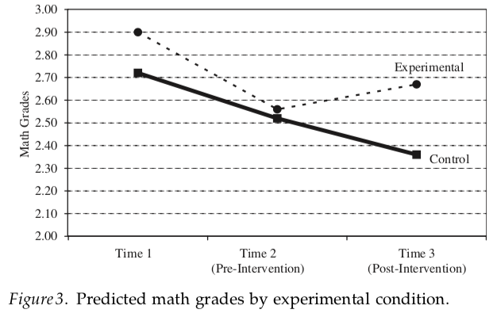

在教育行业，说一个东西是「科学的」往往是很高的评价。家长希望孩子上的培训课是科学的，培训机构也喜欢用科学来标榜自己。

那怎么样的课程是真正科学的？这篇文章从课程效果评估的角度来谈这个问题。

## 从课程效果说起

课程有没有效果，有什么效果，这些是家长非常关心的问题。

有的课程，效果评估起来比较简单，凭借直觉就可以判断。比如你上了减肥课，结果发现自己无情地胖了，那么你可以愤怒地说，这个课没效果！比如你的孩子上了数学补习班，结果数学成绩的确提高了，那么你可以说，这个课有效果。

但是有的课程，效果评估起来就比较困难。比如我说我的课可以培养孩子的科学精神，你要怎么判断课程有没有效果呢？直接出几道和科学精神有关的题目考考孩子？如果孩子答得不错，你怎么保证 TA 不只是纸上功夫，而是真的内化了呢？让孩子做个实验给你看？让孩子说说自己对科学的理解？

你会发现，像科学精神、责任感、好奇心、共情能力，等等这些抽象的品质，不太容易去评估。

这其实也是课程设计中的难题。课程设计往往需要先思考课程的目的，然后围绕课程目的开发课程。有的课程目的写得非常漂亮，这个品质，那个品质，看完之后你觉得国家非常有希望，但是最后很难判断课程是不是真的培养了这些品质。

如果很难评估课程效果，你怎么说这个课是有用的，或者是科学的呢？

## 心理学家上场

我们来看看心理学家是怎么做的。心理学家也会设计课程，并且评估课程效果，尤其是那些教育心理学家。我们来举一个例子。

前段时间网上有个很火帖子，说是美国一个叫 TeachThought 的机构统计了 2018 年最热门的教育关键词，其中「成长心态」高居榜首。

再之前，腾讯创始人之一的陈一丹创立了一个「一丹奖」，该奖项奖金丰厚，并有教育界诺贝尔奖一说。该奖将首届一丹教育研究奖颁给了 Carol S. Dweck 教授——成长心态概念的提出者。

我们这里要说的，就是成长心态背后的课程设计和效果评估。

成长心态，英文是 growth mindset，它的意思其实非常简单：它是一种态度，或者信念，具有这样态度的人很积极，他们认为自己的智力或者能力是可以改变的，可以通过努力改变。

相信你可以感受到成长心态背后蓬勃的正能量。上面说到的 Carol Dweck 教授和同事做了很多研究，发现这么一个小小的成长心态，会深刻影响人们的想法和行为。具有成长心态的人因为相信自己的能力可以改变，所以更加努力，更好学，更能坚持，更不容易被困难打倒，更能从错误中学习，等等，也因此有更高的成就。这方面研究非常非常多，总结性的论文可见 Sarrasin et al.（2018）。

总之，成长心态是个好品质。那么科学家接下来就很自然地发出了灵魂一问：怎么在孩子身上培养这样的品质，怎么样让孩子具有成长心态？

这就呼应到我们上面说的问题了：成长心态是一种抽象的品质，你给孩子上了课，怎么保证孩子真的具有了成长心态？你怎么评估课程效果？

## 成长心态的课程设计

我们先说说 Dweck 他们设计的成长心态课程大概是怎么样的（Blackwell, Trzesniewski, & Dweck, 2007）。

成长心态，你仔细想想，其实我们的教育中也强调这种品质。比如脑子越用越灵，脑子不用会生锈，天才背后有 99% 的汗水，等等，这些都在强调能力可以改变，努力是重要途径。但是这种「道理」可能没什么实际作用。

Dweck 的课也给孩子讲道理，不过是用科学来讲的。成长心态课程的核心是「神经可塑性」，也就是通过实验和科学事实让孩子明白，大脑里的神经联结是可以通过努力改变的，结果就是你变得聪明了！（事实表明，科学的道理，孩子们还是爱听的。）

## 成长心态课程评估的准备工作

重点来了，怎么评价课程的效果？这里有很多亮点，我们一个个来说。

如果你设计了课程，找来一波孩子上课，最终发现孩子变化了，你能说起效果的是你的课程吗？其实并不能，这个过程中可能课程之外的东西在起作用，比如孩子刚好这段时间看了一本大脑的书，比如孩子很喜欢上课的老师所以有了改变，比如孩子这段时间成长了，等等。

所以对于科学家来说，要评价课程的效果，首先要做的，就是排除课程之外的因素，保证只有课程本身在发挥影响。

Dweck 他们做了很多这方面的工作。

首先，Dweck 他们设计了两套课程，一套是成长心态课程，另一套是记忆力的课程。两套课程除了核心内容不同，其它地方都是尽量保证相似。然后找来两波孩子，各上一种课。这么做的目的是，为了让上过成长心态课程的孩子有可以比较的对象。前面说了，你上了课就算有变化，也有各种其它可能的原因。但是如果两波孩子除了核心课程之外，经历过的事情都几乎一样，然后上过成长心态课程的孩子效果更好，那么你可以更放心地说，起作用的是课程，而不是别的因素，因为另一波孩子也经历了这些因素。两套课的论文截图：

其次，两波孩子的条件非常相似。来自同一个学校同一个年级，参与实验之前成绩相似。心理学家还测了其它一些指标，也都相似。这就保证，不是哪波孩子天生更牛逼，而是课程让他们牛逼。

最后，两波孩子的数学老师是同一个，并且这位老师不知道每个学生上的是记忆力的课还是成长心态的课。

说到这里，你可以发现心理学家为了追求严格，做了大量的准备工作。一般的培训机构怎么可能为了搞清楚课程效果还要去专门设计另一套课，找另一波学生来上课，还得非常相似！

## 成长心态课程的效果评估

上面说的还只是准备工作，只是要排除掉干扰因素。那具体怎么评估呢？

心理学里面，为了研究抽象品质，心理学家通常会找一些具体的，容易定量的指标来「逼近」抽象的品质。比如给学生上了成长心态的课，他们理论上会有更高程度的成长心态，那么理论上就会更努力学习，成绩也会更好。

Dweck 他们就是这么做的。

不过可别小看成绩这个指标。如果学生这个学期期末考试得 B，下个学期期末考试得 A，你能说 TA 进步了吗？严格来说，不能。因为试卷难度很可能不一样。这背后有一系列技术问题，导致为了考查学生成绩，心理学家同样需要花费很大的精力。

我们跳过这个技术细节，来看学生最后的成绩：

上面的虚线是上了成长心态课的学生，下面的实线是上了记忆力课的学生。纵坐标代表他们的成绩，越高说明成绩越好。横坐标是三个学期的成绩。在第二个学期（Time 2）的时候，学生开始上课。上课之前，两波学生的成绩都在下降，上课之后，上成长心态课的学生成绩提高了。注意，心理学家可是追踪了这批孩子两个学期啊！

说到这，课程评估的工作完结了。心理学家可以说，成长心态的课的确发挥了作用。

## 总结

这篇文章以成长心态的课程为例，展示了真正科学的课程评估是怎么样的。基于这样的课程评估，我们可以非常明确课程的效果，这是显而易见的优点。

代价同样显而易见：一般人玩不起。没有这个钱，没有这个时间，没有这样的资源。如果所有课程开发都按照这样的流程，学生等不及，社会也等不及。

我也不认同将「科学」和「好」对等。课程设计有科学的成分，也有艺术的成分。很多时候，课程设计者凭借直觉或者人类共有的经验可以设计出非常好的课程，这些课程可能还等不到科学来证明。一位优秀的家长在教育孩子要诚实的时候，TA 能够凭借自己对人性的理解达到很好的教育效果，并不需要哪篇科研论文为 TA 背书。

这篇文章更多的是展示一种严格的课程设计方式，优秀的课程设计者也许可以获得一些启发，家长也可以以此判断培训机构有没有自称的那么科学。

## 参考文献

Blackwell, L. S., Trzesniewski, K. H., & Dweck, C. S. (2007). Implicit theories of intelligence predict achievement across an adolescent transition: A longitudinal study and an intervention. Child Development, 78(1), 246–263. http://doi.org/10.1111/j.1467-8624.2007.00995.x

Sarrasin, J. B., Nenciovici, L., Foisy, L.-M. B., Allaire-Duquette, G., Riopel, M., & Masson, S. (2018). Effects of teaching the concept of neuroplasticity to induce a growth mindset on motivation, achievement, and brain activity: A meta-analysis. Trends in Neuroscience and Education, 12, 22–31. http://doi.org/10.1016/j.tine.2018.07.003
