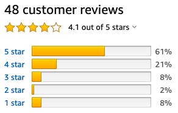

假设你想自学心理学（或哲学、物理、数学……），准备买些书来看。问，你应该选择什么样的书？

有几种常见的选择：

1. 经典读物，或大师著作。比如一说到心理学，你就想到弗洛伊德，于是毫不犹豫把《梦的解析》放进强东兄的购物车。理由不外乎是这些大师很牛，他们的著作很经典，而且因为是看原著，所以能接收到最纯正的大师思想。

2. 科普。科普给人感觉比较轻松，不用数学公式却能讲最深的理论，仿佛滋溜一声就能入门任何学科。

3. 论文。论文最硬核，专家都读论文，你要走专业路线，怎能不读？

4. 心理学史。要学习一门学科，怎么能不知道它的过去？

5. 网上的老张老王列的书单。网上有很多类似于「学 xx 必看的 n 本书」，你点开书单一看感觉都很重要，于是全部买来。

6. ……

到底应该选什么书呢？这篇文章的主旨很简单：**对于偏知识性的、成体系的学科，自学最应该重视一种书——教材。**

## 为什么是教材？

因为只有教材能做到：**默认你没有一点专业知识，却以把你教成专家为目的，用友好有效的方式，帮你搭建知识体系。**

首先，教材会假设你没有一点专业知识，（而因此会）用友好易懂的方式向你传递知识。好的教材会如同舒肤佳一般地给你非常细心的呵护，会默认你什么都不懂，一点点地传递知识。好的教材会用大量的图，大量的例子，大量的对外行友好的语言，逐渐深入。

我来看一个心理学教材的例子《Psychology: Themes and Variations》：

这本教材评价非常高，国内有引进，目前已出到第十版。全书将近 1000 多页，看着吓人，但是都是有趣的图片和例子。比如在下面几张截图是在讲心理学的历史。

冯特创立心理学实验室：

大名鼎鼎的弗洛伊德：

斯金纳的女儿坐在斯金纳发明的箱子中：

你可以感受到这本书的内容非常详实有趣。

第二，教材虽然有趣易懂，但仍然不失专业性。好的教材虽然对外行友好，但是这个友好并不会以损失专业性为代价。它不会为了让你觉得顺滑，就故意避免公式，避免难的知识点。它只会想办法用最易懂的语言来讲解这些知识。讲得是通俗易懂，但是知识不打折扣。

第三，教材搭建知识体系。这也是最重要的一点，教材帮你建立知识体系。是体系，不是零散的趣味事实，不是一些炫酷的术语，不是「道理」。而你一旦掌握了这套体系，你就离专家的思维方式更近一步。

## 为什么不是其它类型的书？

说完教材的特点，你应该能意识到，为什么应该看教材而不是其它这些类型的书。

为什么不是大师的经典著作？再牛逼的大师，再牛逼的思想，都只是庞大知识体系中的一个节点。你需要的是一个知识体系，而非一个哪怕再绚烂的节点。如果大师的思想非常重要，它必然会以恰当的方式体现在教材的知识体系当中。如果你有更多的兴趣，那完全可以在有了知识体系后再深入大师的思想，而不是反过来。另外，大师的书未必对外行友好。

为什么不是科普？因为科普为了让自己顺滑易懂，往往会牺牲专业性。比如有的科普会介绍自己说「没有一个公式」，听着是轻松，但你与专家的距离会永远相差一个公式。科普不会试图搭建知识体系，顶多在你最轻松的理解范围内，搭一个小矮房。你觉得自己站得更高了，但永远看不到专家站在知识大厦上看到的风景。

为什么不是论文？因为论文虽然重要，但你读不了。你首先需要的是建立对森林的认识，然后才是树木。当然，等你入门之后，论文必不可少，我们后面会说。

为什么不是心理学史？因为教材里一般会包括必要的历史知识，你没必要专门去找一本历史书来看。

为什么不是网上的书单？因为教材就是一个迷你书单，它就像一个功能完好的贴心小 APP，重要的功能都有了，不多不少。你不需要参考任何人的书单，完全可以自己去找教材。

## 好教材的特点

很多人很讨厌教材，那是因为我们很容易接触到不好的教材。比如见[网友对同济大学应用数学系的高等数学教材的评价](https://book.douban.com/review/2906131/)，以及见[网友对谭浩强的 C 语言教材的评价](https://www.zhihu.com/question/26692254)。国内有很多专家教授写出了很多非常垃圾的教材，非常让人痛心，希望大家明辨好坏，不要跳入不必要的坑。

好的教材通常有一些肉眼可见的特点：

首先，评价很高。比如上面说的那本心理学教材，在 Amazon 的评分如下：

在豆瓣上的评价：

两个网站里都有读者更细致的评价，可以给你更多的信息。

第二，很漂亮。好的教材有个非常直观的特点——图片很丰富。

第三，多次再版。上面说的心理学教材已经出到第十版，下面这些都是多次出版的经典教材：

物理学教材《University Physics with Modern Physics》已经出到第 15 版：

微积分教材《Thomas' Calculus》已经出到第 14 版：

第四，很厚。如果是像心理学或物理学这种知识体系庞大的学科，其教材往往很厚。这主要是因为图片，以及大量的解释和例子。不好的教材往往会薄很多，你看着看着会觉得自己很笨，因为它讲解得很快很不耐心，你也往往会觉得作者对这门学科缺乏热爱。
