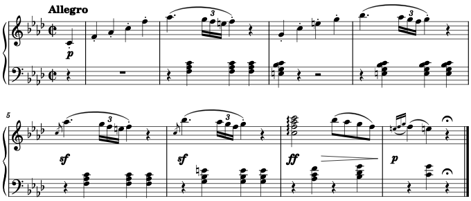

Automatic composition is using algorithms to generate music. In this blog, I will use algorithms derived from music theories to explore how to auto-compose music. My [Python package "ch0p1n"](https://github.com/flujoo/ch0p1n) will be used.

Automatic composition has different approaches or paradigms,[^1] among which the one utilizing AI techniques is especially impressive and promising. In contrast, the "manual" knowledge-based approach I take here seems outdated. However, I still hope this blog will provide insights into the process of musical composition.

Let's start with an example.

## Example 1: Beethoven's Piano Sonata

<audio controls>
  <source src="assets/sonata.mp3" type="audio/mpeg">
</audio>

The above is the first eight measures of the first movement of Beethoven's first piano sonata. These eight measures just form a structure called **theme**.[^2] A theme of a musical work is like a chapter of a book or a section of an article; it is the smallest unit that expresses a complete musical thought. A musical work usually consists of several themes that are quite independent from each other. Each theme has its own beginning and end, and also has its particular materials and qualities. So if we can auto-compose musical themes, then we can auto-compose whole musical works. Our problem is thus reduced.

Let's go back to the example. Close scrutiny reveals redundancy or regularity in the music.

First, as indicated below, the structures in the red and the blue frames have almost identical morphology:

In theorist William Caplin's terms, these structures are called **basic idea** and **repetition** of basic idea, respectively.[^2] As the name implies, the latter structure is just a repetition of the basic idea, although the repetition is inexact, because the background harmony has changed from Fm to C7, and the repetition has to adapt to the new harmony.

[^1]: Nierhaus, G. (2009). Algorithmic composition: paradigms of automated music generation. Springer Science & Business Media.
[^2]: Caplin, W. E. (2013). Analyzing Classical Form: An Approach for the Classroom. Oxford University Press.
