Given a harmonic progression and the first accompaniment motif, how to automatically generate an entire accompaniment progression?

In this blog, I will tackle this problem with R language and [R package "gm"](https://github.com/flujoo/gm). Please note that, for illustrative purposes, the solution presented here is only a simplified version. I will talk more about this in the last section.

Let's first clarify the problem, before diving into it.


## Clarify the Problem

Take the beginning of Chopin's nocturne Op.9 No.1 as an example:

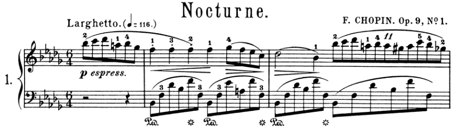

<audio controls>
  <source src="audio/nocturne.mp3" type="audio/mpeg">
</audio>

By **accompaniment motifs**, I mean the structures in the red frames in the following score:

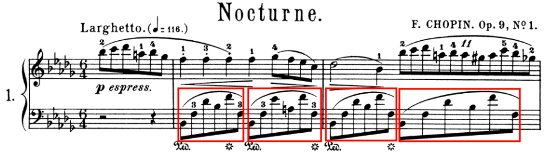

<audio controls>
  <source src="audio/accompaniment.mp3" type="audio/mpeg">
</audio>

By **harmonic progression**, I mean the sequence of the background harmonies behind these accompaniment motifs, which is B♭m, F7, B♭m and B♭m.

Thus the problem here is that, given only a starting accompaniment motif such as

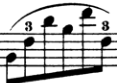

and a harmonic progression such as B♭m, F7, B♭m and B♭m or other ones, how to generate an entire accompaniment progression such as

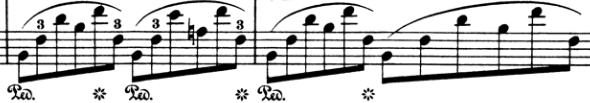


## Main Idea

Let's have a look of the first two accompaniment motifs to gain some insights:

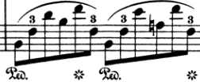

<audio controls>
  <source src="audio/two.mp3" type="audio/mpeg">
</audio>

They have almost the same morphology. Their only differences are caused by the background harmonies. When the first accompaniment motif moves into or repeats in a new "harmonic environment", it has to change some pitches to adapt to the new environment.

However, the differences caused by adaptation are kept as minimum as possible. For example, the pitch of the second note of the first motif is F3, and that of the second motif is also F3. Since the harmony behind the second motif is F dominant 7th whose pitch classes include F, there is no need for F3 to change.

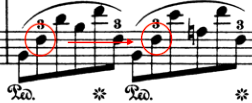

Also, the pitch of the third note of the first motif is D♭4, but there is no D♭ in the pitch classes of F dominant 7th, so it moves to a nearest pitch E♭4.

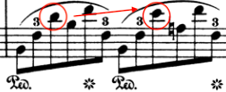

This "move as minimum as possible" principle is no accident. Some theorist calls it **common tone rule** and **nearest chordal tone rule**.[^1] These rules are like "industrial standards", which are taught in textbooks and usually followed by composers. They are also the core of the solution to our problem, which can be stated as follows:

Suppose we have a starting accompaniment motif and a harmonic progression. We first make this motif adapt to the first harmony from the harmonic progression, to generate the second accompaniment motif. In the process, "move as minimum as possible" principle is obeyed. We then make the second motif adapt to the second harmony to generate the third motif. Repeat this process, until an entire accompaniment progression is generated.

Now let's implement this in R.


## Represent Motifs and Harmonies

From data structure perspective, a motif is just a list of notes or chords, and each note has two components, which are pitch and duration. However, to simplify the problem, chords and durations are ignored here. Therefore, a motif is a list of pitches.

To represent pitches, [MIDI note numbers](https://en.wikipedia.org/wiki/Scientific_pitch_notation#Table_of_note_frequencies) rather than scientific pitch notations such as E4 are used, for ease of operation. Therefore, a motif can be represented as a vector of integers in R. For example, the first accompaniment motif of Chopin's nocturne can be represented as

```r
c(46, 53, 61, 58, 65, 53)
```

It is equivalent to

```r
c("B-2", "F3", "D-4", "B-3", "F4", "F3")
```

A harmony is a list of [pitch classes](https://en.wikipedia.org/wiki/Pitch_class#Other_ways_to_label_pitch_classes). It can be represented as a vector of integers. For example, C major can be represented as

```r
c(0, 4, 7)
```

It is equivalent to

```r
c("C", "E", "G")
```


## Show Motifs

We can use [R package "gm"](https://github.com/flujoo/gm) to show the first motif:

```r
library(gm)

# pitches
ps <- as.list(c(46, 53, 61, 58, 65, 53))

# durations
ds <- rep(list(0.5), 6)

m <-
    Music() +
    Tempo(110) +
    Meter(6, 4) +
    Key(-5) +
    Line(ps, ds) + 
    Clef("F", to = 1)

show(m, to = c("score", "audio"))
```


<audio controls>
  <source src="audio/gm.mp3" type="audio/mpeg">
</audio>

The code is straightforward. See [the documentation of "gm"](https://flujoo.github.io/gm/articles/gm.html) for more details.

Let's wrap the code into a function for further use:

```r
show_motif <- function(motif) {
    ps <- as.list(motif)
    ds <- rep(list(0.5), length(motif))

    m <-
        Music() +
        Tempo(110) +
        Meter(6, 4) +
        Key(-5) +
        Line(ps, ds) + 
        Clef("F", to = 1)

    show(m, to = c("score", "audio"))
}
```


## Get Neighbor Pitches

As mentioned above, if a pitch in a motif does not match the new harmony, it has to move to a nearest pitch. So we need a function that gets a pitch's neighbor pitches:

```r
get_pitches <- function(pitch, harmony) {
    ps <- pitch + -2:2
    ps[(ps %% 12) %in% harmony]
}
```

Let's have a test. Suppose we have a pitch D♭4 whose MIDI note number is 61, and a harmony F dominant 7th whose pitch classes are F, A, C and E♭, or 5, 9, 0 and 3. The neighbor pitches of D♭4 should be C4 and E♭4, or 60 and 63.

```r
get_pitches(61, c(5, 9, 0, 3))

#> [1] 60 63
``` 

The result is correct.


## Generate Candidate Motifs

As you have seen in the above example, a pitch can have more than one neighbor pitch in a new harmony, which means that a motif can generate more than one motif in a new harmony.

Now we have two strategic options. First, we write a function which takes a motif as input and returns exactly one motif. Second, we write two functions, the first of which generates some candidate motifs, and the second of which selects the best one from those candidates.

The first strategy is straightforward, but in my experience, the second strategy, which we will take, is far easier to implement.

Let's first create a function to generate candidates, which takes a motif and returns a list of motifs:

```r
# use pipe operator `%>%`
library(magrittr)

generate_motifs <- function(motif, harmony) {
    ps <- mapply(
        get_pitches,
        as.list(motif),
        MoreArgs = list(harmony = harmony),
        SIMPLIFY = FALSE
    )

    motifs <- 
        ps %>%
        expand.grid() %>%
        t() %>%
        as.data.frame() %>%
        as.list()

    names(motifs) <- NULL
    motifs
}
```

Let's try this function on the first motif of Chopin's nocturne:

```r
motifs <- generate_motifs(
    c(46, 53, 61, 58, 65, 53),
    c(5, 9, 0, 3)
)

length(motifs)

#> [1] 64
```

There are total 64 candidates! This is overwhelming. Let's create a function to select only the best one.


## Select from Candidates

These candidates are not all equally good. Some do not fully reify the background harmony, such as the 52rd motif:

```r
show_motif(motifs[[52]])
```


This motif does not have pitch class E♭.

And some candidates have ugly contours so that they do not sound very good, such as the ninth motif:

```r
show_motif(motifs[[9]])
```


The third and fourth pitch of this motif are the same.

Let's create some functions to screen out ill-formed motifs.

```r
# check if a motif fully reify the given harmony
is_complete <- function(motif, harmony) {
    all(harmony %in% (motif %% 12))
}

# check if a motif has the same contour as the original one
has_same_contour <- function(motif, motif_0) {
    all(order(motif) == order(motif_0))
}

# wrap the above two functions
is_good <- function(motif, harmony, motif_0) {
    is_complete(motif, harmony) &&
        has_same_contour(motif, motif_0)
}
```

Let's try this function on those 64 candidates:

```r
motifs <- Filter(
    function(motif) is_good(
        motif,
        c(5, 9, 0, 3),
        c(46, 53, 61, 58, 65, 53)
    ),

    motifs
)

length(motifs)

#> [1] 18
```

We still have 18 candidates. We can write more screening functions to reduce the number. For example, for a dominant 7th harmony, the third should not be doubled. However, to simplify the problem, we will stop here, and just take the first candidate.


## Generate Progression

Now let's put all these together. We will create a single function that takes a motif and a harmony progression as input, generates an entire accompaniment progression, and shows it:

```r
generate_progression <- function(motif, harmonies) {
    prog <- list(motif)
    m0 <- motif

    for (h in harmonies) {
        ms <- generate_motifs(m0, h)
        m <- Filter(function(m) is_good(m, h, m0), ms)[[1]]
        m0 <- m
        prog <- c(prog, m)
    }

    show_motif(unlist(prog))
}
```

Let's try it on some harmony progression:

```r
motif <- c(46, 53, 61, 58, 65, 53)

harmonies <- list(
    c(3, 6, 10),
    c(5, 9, 0, 3),
    c(10, 1, 5)
)

generate_progression(motif, harmonies)
```


<audio controls>
  <source src="audio/prog.mp3" type="audio/mpeg">
</audio>

Not too bad!


## Discussion

As mentioned earlier, this solution has some limitations, mainly because accompaniment motifs can have far more complex structures. For example, they can contain pedal notes as in Chopin's nocturne Op.9 No.1:

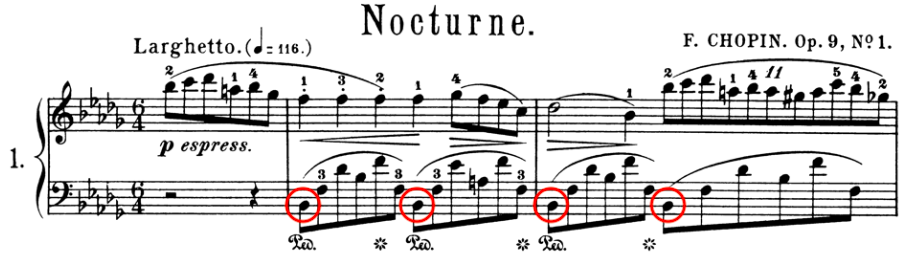

chords as in Chopin's nocturne Op.9 No.2:

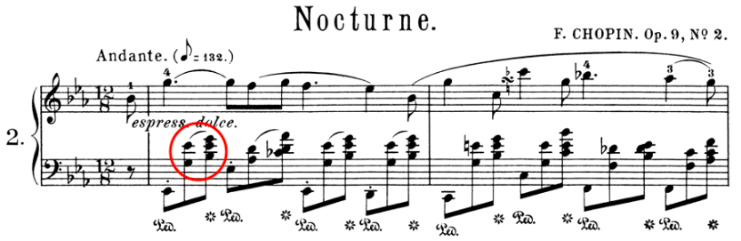

non-harmonic notes as in Chopin's nocturne Op.72 No.1:

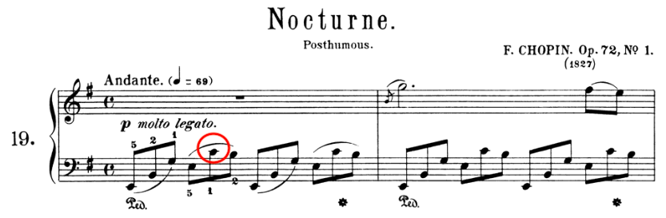

more than one voice as in Chopin's nocturne Op.15 No.1:

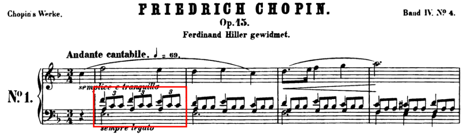

However, with this being said, the idea behind this solution applies not only to accompaniment motifs, but also to melodic motifs and even bigger structures, as in Beethoven's first piano sonata:


See my other blog [Three Types of Music Analysis](/en/three-types-of-music-analysis) for some discussion.


[^1]: Huron, D. (2001). Tone and voice: A derivation of the rules of voice-leading from perceptual principles. Music Perception, 19(1), 1-64.
