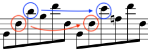
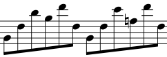

In this blog, I will introduce my approach to automatic musical composition, including the theory, the algorithm, and a Python package implementation [ch0p1n](https://github.com/flujoo/ch0p1n).


## What Is Automatic Composition?

Automatic composition is using algorithms to generate music.

As a trivial example, imagine that you put a cat on a piano to randomly press keys to generate music. The music is thus the result of a predetermined algorithm rather than of your instantaneous emotions or compositional skills. This is why it is called *automatic* composition.

Automatic composition has many different approaches or paradigms.[^1] The approach I take is inspired by the theories of Arnold Schoenberg, Heinrich Schenker and William Caplin. The key idea is that **music can develop or be generated from limited materials under some common operations**. I will explain the theoretical foundation of my approach in the following three sections.


## Generate Music from Limited Materials

Let's see an example, the beginning of Beethoven's first piano sonata:


<audio controls>
  <source src="assets/beethoven_sonata.mp3" type="audio/mpeg">
</audio>

As indicated below, the two framed structures are almost identical:


In fact, the structure in the blue frame can be generated by merely transposing the structure in the red one. Therefore, to compose this piece, I need only to create the structure in the red frame, then reuse or slightly modify it to generate the structure in the blue frame, rather than create both structures from scratch.

The same situation happens in other parts too. As indicated below, the four framed structures are also highly similar:


Does this kind of reuse exist only in Beethoven's music? No, this probably happens in every musical work. **No matter how long a musical work lasts or how varied it can sound, the amount of its core materials is always small.**

For another example, the following is an excerpt from Mozart's K. 485:


Sometimes, however, a material can be modified so much that you can barely recognize it, as in the following example, the beginning of Chopin’s nocturne Op.9 No.1:


<audio controls>
  <source src="assets/chopin_op9_no1.mp3" type="audio/mpeg">
</audio>

The two framed structures look and sound quite different, but, in my approach, it is still that the structure in the blue frame can be generated by elaborating the structure in the red one, rather than that they are totally unrelated. It is so because the two structures have some morphological characteristics in common, they have the same background harmonic progression, and from the perspective of musical form, the structure in the blue frame is indeed a repetition of the structure in the red one.[^2]

Please note that, in stating that a structure can be generated from other structure, I do not assert that Beethoven or Chopin actually did this or deliberately did this when composing music. Rather, my point is that we can use this music generation perspective to formalize or automate the process of musical composition.


## Common Operations to Manipulate Materials

Once a structure is created, some common operations can be applied to them to generate new structures. I will talk about some operations below.

The first operation I will talk about is **repetition**. It means repeating a structure in a new harmony without changing its morphology.[^3]

The Beethoven's sonata is an example of repetition:


The structure in the blue frame is a **transposition** of the structure in the red one. The two structures have the same morphology, although they are adapted to different background harmonies.

The Chopin's nocturne is another example. The accompaniment motif in the blue frame is a repetition of the one in the red frame:


In the repetition, some pitches move to their nearest pitches to fit the new harmony, according to some voice-leading rules.[^4] Some of these changes are indicated below:



<audio controls>
  <source src="assets/chopin_op9_no1_accompaniment_2.mp3" type="audio/mpeg">
</audio>

The next operation is **elaboration**. It means adding passing notes, neighbor notes, and other types of notes to a structure. The Chopin's nocturne is an example, in which a lot of tuplets are added in the repetition:


Sometimes, elaborations are rather inferred from than showed in scores. Heinrich Schenker's theory differentiates music's superficial structure from its deep structure(s), and the superficial structure is the outcome of elaboration of a deep structure, as showed in the following example:[^5]


In the above score, for example, piece b can be generated by elaborating piece c.

The opposite operation of elaboration is **reduction**. For example, in the above score, piece b can be reduced to piece c.

The last operation I will talk about is **fragmentation**. It means taking a fragment from a material.

As in the Beethoven's sonata, the structure in the blue frame is a fragment from the structure in the red one:


The Chopin's nocturne is a more interesting example:


<audio controls>
  <source src="assets/chopin_op9_no1_antecedent.mp3" type="audio/mpeg">
</audio>

The fragment in the red frame can be modified to generate the structure in the orange frame; the fragment in the blue frame can be modified to generate the structures in the green frames. The two fragments are taken from the structure in the purple frame.

There are more operations can be applied to musical materials, but I will stop here. The four operations I have introduced are enough for the purpose of this blog.


## Combine Materials According to Musical Forms

Created and generated structures can be combined into larger structures, according to musical forms. A **musical form** is a way in which musical materials should be organized.

For example, the beginning of the Beethoven's sonata has the form **sentence**. Below is how this sentence is analyzed in William Caplin's system:[^2]


The beginning of the Chopin's nocturne is from a larger structure of the form **compound period**, which is far more complex than sentence.

I will not go deep into the subject of musical forms here. I highly recommend William Caplin's excellent textbook[^2] on this topic. My key point is that musical materials should be combined according to musical forms to generate meaningful music.


## Summary of the Theoretical Foundation

There are three key concepts in the theory behind my approach:

1. **limited core materials**, from which more materials can be generated,
2. **common operations**, which can be applied to materials to generate more, and
3. **musical forms**, according to which materials should be combined.

Now it is time to turn the theory into an algorithm.


## Represent Musical Structures

We first need to strictly define musical *materials* and *structures*, which we have been talking about quite vaguely.

Let's return to the Beethoven's sonata. Below is its first two bars:


This piece of music has two voices or musical lines. Each musical line consists of notes, rests or chords which consist of notes too. A note has several attributes, among which only pitch and duration will be considered here. Rather than represent notes as single objects, we will handle their pitch and durational contents separately.

**Pitches** can be represented by [scientific pitch notations](https://en.wikipedia.org/wiki/Scientific_pitch_notation) or [MIDI note numbers](https://en.wikipedia.org/wiki/Scientific_pitch_notation#Table_of_note_frequencies). Mostly, the latter are used, for ease of operation. For example, pitch C4 is represented by MIDI note number 60.

The pitch content of a **rest** can be represented by `None` in Python.

The pitch contents of a **chord** can be represented by list in Python. For example, in Python we can use `['C4', 'A-3', 'F3']` or `[60, 56, 53]` to represent the pitch contents of the chord in the red frame:


**Durations** can be represented by numbers. For example, quarter note's duration is 1.

The pitch contents of a **musical line** can be represented by what I call **pitch line**. In Python, a pitch line is a list whose members are `None`, numbers or lists of numbers. With Python package [typing](https://docs.python.org/3/library/typing.html), pitch line can be defined as

```python
from typing import List, Union

Pitch = int
PitchLine = List[Union[None, Pitch, List[Pitch]]]
```

The durational contents of a musical line can be represented by **duration line**. In Python, a duration line is a list whose members are numbers.

Finally, **harmonies** and **scales** can be represented by lists of [pitch classes](https://en.wikipedia.org/wiki/Pitch_class#Other_ways_to_label_pitch_classes). For example, in Python C major harmony can be represented by `['C', 'E', 'G']` or `[0, 4, 7]`.


## Motifs

You may have heard this term a lot. A **motif** is structurally a musical line, usually short in length. Motifs are the building blocks of music. They can be repeated, elaborated, fragmented and combined to generate music.

For example, the following is how Schoenberg analysed the beginning of the Beethoven's sonata:[^6]


In his analysis, the melody part of this piece can be generated from only three motifs.

There are different kinds of motifs. For example, two kinds of motifs are framed in the following score:


The motifs in the red frames can be called **accompaniment motifs** as they appear in the accompaniment line of this nocturne. They can also be called **harmonic motifs** as they consist of only harmonic notes. The motifs in the blue frames can be called **melodic motifs** as they appear in the melody line.


## Repeat Harmonic Motifs

Repetition is an important and frequently used operation. We will first consider how to repeat harmonic motifs.

In the Chopin's nocturne, a long accompaniment line (indicated by frames) can be generated from only one starting accompaniment motif under the operation repetition (indicated by arrows):


The basic idea behind this generation is:

- Repeat a motif in a harmony to generate a new motif.
- Repeat this new motif in the next harmony to generate another motif.
- Repeat this process until a whole accompaniment line is generated.

Then the core question is how to repeat a motif in a harmony.

Let's have a look at the first two accompaniment motifs from the nocturne:



<audio controls>
  <source src="assets/chopin_op9_no1_accompaniment_2.mp3" type="audio/mpeg">
</audio>

The background harmonies behind these two motifs are B♭m and F7. Except for the first note which is a [pedal note](https://en.wikipedia.org/wiki/Pedal_point), when the first motif is repeated in harmony F7, all pitches move to their nearest pitches in the new harmony.

For example, the second pitch of the first motif is F3 and that of the second motif is also F3. Since the harmony behind the second motif is F dominant 7th whose pitch classes include F, there is no need for F3 to change. Meanwhile, the third pitch of the first motif is D♭4, but there is no D♭ in the pitch classes of F dominant 7th, so it moves to a nearest pitch E♭4.

This is pretty much it. **To repeat a harmonic motif in a harmony, just move every pitch to its nearest neighbor in the harmony.**

Please note that there may be more than one neighbor for a pitch. For example, in the Chopin's nocturne, the third pitch of the first motif is D♭4, its neighbors are C4 and E♭4. Therefore, to repeat a motif, we can generate many candidate motifs in the new harmony, then select the best one from them. For example, some candidates may not have the same morphology as the original motif; some may not fully reify the background harmony. See my blog [Generate Accompaniment Progression](/en/generate-accompaniment-progression/) for more details.


## Implementation of Repetition

The function `lead()` from my Python package [ch0p1n](https://github.com/flujoo/ch0p1n) is for repeating harmonic motifs.

```python
from ch0p1n.motif import lead
```


[^1]: Nierhaus, G. (2009). Algorithmic Composition: Paradigms of Automated Music Generation. Springer Science & Business Media.

[^2]: Caplin, William E. (2013). Analyzing Classical Form: an Approach for the Classroom. Oxford and New York: Oxford University Press.

[^3]: This definition of repetition is narrower than Arnold Schoenberg's and William Caplin's.

[^4]: Huron, D. (2001). Tone and voice: A derivation of the rules of voice-leading from perceptual principles. Music Perception, 19(1), 1-64.

[^5]: Pankhurst, T. (2008). SchenkerGUIDE: a brief handbook and website for Schenkerian analysis (p. 11). Routledge.

[^6]: Schoenberg, A., Stein, L., & Strang, G. (1967). Fundamentals of musical composition (p. 63). London: Faber & Faber.
