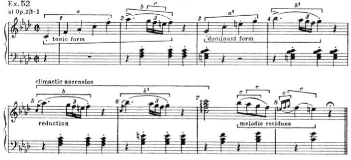

In this blog, I will introduce my approach to automatic musical composition, including the theory, the algorithm, and a Python package implementation [ch0p1n](https://github.com/flujoo/ch0p1n).


## What Is Automatic Composition?

Automatic composition is using algorithms to generate music.

As a trivial example, imagine that you put a cat on a piano to randomly press keys to generate music. The music is thus the result of a predetermined algorithm rather than of your instantaneous emotions or compositional skills. This is why it is called *automatic* composition.

Automatic composition has many different approaches or paradigms.[^1] The approach I take is inspired by the theories of Arnold Schoenberg, Heinrich Schenker and William Caplin. The key idea is that **music can develop or be generated from limited materials under some common operations**. I will explain the theoretical foundation of my approach in the following three sections.


## Generate Music from Limited Materials

Let's see an example, the beginning of Beethoven's first piano sonata:


<audio controls>
  <source src="assets/beethoven_sonata.mp3" type="audio/mpeg">
</audio>

As indicated below, the two framed structures are almost identical:


In fact, the structure in the blue frame can be generated by merely transposing the structure in the red one. Therefore, to compose this piece, I need only to create the structure in the red frame, then reuse or slightly modify it to generate the structure in the blue frame, rather than create both structures from scratch.

The same situation happens in other parts too. As indicated below, the four framed structures are also highly similar:


Does this kind of reuse exist only in Beethoven's music? No, this probably happens in every musical work. **No matter how long a musical work lasts or how varied it can sound, the amount of its core materials is always small.**

For another example, the following is an excerpt from Mozart's K. 485:


Sometimes, however, a material can be modified so much that you can barely recognize it, as in the following example, the beginning of Chopin’s nocturne Op.9 No.1:


<audio controls>
  <source src="assets/chopin_op9_no1.mp3" type="audio/mpeg">
</audio>

The two framed structures look and sound quite different, but, in my approach, it is still that the structure in the blue frame can be generated by elaborating the structure in the red one, rather than that they are totally unrelated. It is so because the two structures have some morphological characteristics in common, they have the same background harmonic progression, and from the perspective of musical form, the structure in the blue frame is indeed a repetition of the structure in the red one.[^2]

Please note that, in stating that a structure can be generated from other structure, I do not assert that Beethoven or Chopin actually did this or deliberately did this when composing music. Rather, my point is that we can use this music generation perspective to formalize or automate the process of musical composition.


## Common Operations to Manipulate Materials

Once a structure is created, some common operations can be applied to them to generate new structures. I will talk about some operations below.

The first operation I will talk about is **repetition**. It means repeating a structure in a new harmony without changing its morphology.

The Beethoven's sonata is an example of repetition:


The structure in the blue frame is a **transposition** of the structure in the red one. The two structures have the same morphology, although they are adapted to different background harmonies.

The Chopin's nocturne is another example. The accompaniment motif in the blue frame is a repetition of the one in the red frame:


In the repetition, some pitches move to their nearest pitches to fit the new harmony, according to some [voice-leading](https://en.wikipedia.org/wiki/Voice_leading) rules.[^3] Some of these changes are indicated below:


<audio controls>
  <source src="assets/chopin_op9_no1_accompaniment_2.mp3" type="audio/mpeg">
</audio>

The next operation is **elaboration**. It means adding passing notes, neighbor notes, and other types of notes to a structure. The Chopin's nocturne is an example, in which a lot of tuplets are added in the repetition:


Sometimes, elaborations are rather inferred from than showed in scores. Heinrich Schenker's theory differentiates music's superficial structure from its deep structure(s), and the superficial structure is the outcome of elaboration of a deep structure, as showed in the following example:[^4]


In the above score, for example, piece b can be generated by elaborating piece c.

The opposite operation of elaboration is **reduction**. For example, in the above score, piece b can be reduced to piece c.

The last operation I will talk about is **fragmentation**. It means taking a fragment from a material.

As in the Beethoven's sonata, the structure in the blue frame is a fragment from the structure in the red one:


The Chopin's nocturne is a more interesting example:


<audio controls>
  <source src="assets/chopin_op9_no1_antecedent.mp3" type="audio/mpeg">
</audio>

The fragment in the red frame can be modified to generate the structure in the orange frame; the fragment in the blue frame can be modified to generate the structures in the green frames. The two fragments are taken from the structure in the purple frame.

There are more operations can be applied to musical materials, but I will stop here. The four operations I have introduced are enough for the purpose of this blog.


## Combine Materials According to Musical Forms

Created and generated structures can be combined into larger structures, according to musical forms. A **musical form** is a way in which musical materials should be organized.

For example, the beginning of the Beethoven's sonata has the form **sentence**. Below is how this sentence is analyzed in William Caplin's system:[^2]


The beginning of the Chopin's nocturne is from a larger structure of the form **compound period**, which is far more complex than sentence.

I will not go deep into the subject of musical forms here. I highly recommend William Caplin's excellent textbook[^2] on this topic. My key point is that musical materials should be combined according to musical forms to generate meaningful music.


## Summary of the Theoretical Foundation

There are three key concepts in the theory behind my approach:

1. **limited core materials**, from which more materials can be generated,
2. **common operations**, which can be applied to materials to generate more, and
3. **musical forms**, according to which materials should be combined.

Now it is time to turn the theory into an algorithm.


## Represent Musical Structures

We first need to strictly define musical *materials* and *structures*, which we have been talking about quite vaguely.

Let's return to the Beethoven's sonata. Below is its first two bars:


This piece of music has two voices or musical lines. Each musical line consists of notes, rests or chords which consist of notes too. A note has several attributes, among which only pitch and duration will be considered here. Rather than represent notes as single objects, we will handle their pitch and durational contents separately.

**Pitches** can be represented by [scientific pitch notations](https://en.wikipedia.org/wiki/Scientific_pitch_notation) or [MIDI note numbers](https://en.wikipedia.org/wiki/Scientific_pitch_notation#Table_of_note_frequencies). Mostly, the latter are used, for ease of operation. For example, pitch C4 is represented by MIDI note number 60.

The pitch content of a **rest** can be represented by `None` in Python.

The pitch contents of a **chord** can be represented by list in Python. For example, in Python we can use `['C4', 'A-3', 'F3']` or `[60, 56, 53]` to represent the pitch contents of the chord in the red frame:


**Durations** can be represented by numbers. For example, quarter note's duration is 1.

The pitch contents of a **musical line** can be represented by what I call **pitch line**. In Python, a pitch line is a list whose members are `None`, numbers or lists of numbers. With Python package [typing](https://docs.python.org/3/library/typing.html), pitch line can be defined as:

```python
from typing import List, Union

Pitch = int
PitchLine = List[Union[None, Pitch, List[Pitch]]]
```

The durational contents of a musical line can be represented by **duration line**. In Python, a duration line is a list whose members are numbers.

Finally, **harmonies** and **scales** can be represented by lists of [pitch classes](https://en.wikipedia.org/wiki/Pitch_class#Other_ways_to_label_pitch_classes). For example, in Python C major harmony can be represented by `['C', 'E', 'G']` or `[0, 4, 7]`.


## Motifs

You may have heard this term a lot. A **motif** is structurally a musical line, usually short in length. Motifs are the building blocks of music. They can be repeated, elaborated, fragmented and combined to generate music.

For example, the following is how Schoenberg analysed the beginning of the Beethoven's sonata:[^5]



In his analysis, the melody part of this piece can be generated from only three motifs.

There are different kinds of motifs. For example, two kinds of motifs are framed in the following score:


The motifs in the red frames can be called **accompaniment motifs** as they appear in the accompaniment line of this nocturne. They can also be called **harmonic motifs** as they consist of only harmonic notes. The motifs in the blue frames can be called **melodic motifs** as they appear in the melody line, or **non-harmonic motifs** if they contain non-harmonic notes.

In the following several sections, I will talk about the implementation of the common operations that can be applied to motifs.


## Implementation of Repetition: `transpose()`

The function `transpose()` from my Python package [ch0p1n](https://github.com/flujoo/ch0p1n) is for transposing a motif along a scale.

Suppose there is a motif which can be represented as:

```python
pitch_motif = [60, 67, 76, 72]
# ['C4', 'G4', 'E5', 'C5']

duration_motif = [1, 1, 1, 1]
```

Remember that we separately represent a motif's pitch and durational contents.

We can show this motif in score with `show()`, which is built on Python package [music21](https://github.com/cuthbertLab/music21):

```python
from ch0p1n.utils import show

show(
  pitch_lines = [pitch_motif],
  duration_lines = [duration_motif],
  group = 1, # the number of voices in the treble staff
  key = 0,
  meter = '4/4',
  clefs = ['g', 'f']
)
```


Transpose it up by one step along the C major scale:

```python
from ch0p1n.motif import transpose

pitch_motif_transposed = transpose(
  pitch_motif = pitch_motif,
  scale = [0, 2, 4, 5, 7, 9, 11],
  step = 1
)
```

The code is pretty self-explanatory. Let's check the result:

```python
>>> pitch_motif_transposed

[62, 69, 77, 74]
```

```python
show(
  pitch_lines = [pitch_motif_transposed],
  duration_lines = [duration_motif],
  group = 1, # the number of voices in the treble staff
  key = 0,
  meter = '4/4',
  clefs = ['g', 'f']
)
```


It looks good. Every pitch has moved up by one step along the C major scale.

Since harmony is a special kind of scale, we can use `transpose()` to repeat the motif in a harmony, say, the G major harmony:

```python
pitch_motif_transposed = transpose(
  pitch_motif = pitch_motif,
  scale = [7, 11, 2], # G major harmony
  step = 1
)
```

Let's show the original and the transposed motifs together:

```python
show(
  pitch_lines = [pitch_motif + pitch_motif_transposed],
  duration_lines = [duration_motif * 2],
  group = 1,
  key = 0,
  meter = '4/4',
  clefs = ['g', 'f']
)
```


The original motif is in the first bar, and the transposed the second. You can see how each pitch moves up by one step in the G major harmony.

In some cases, however, `transpose()` does not work well. Still in the above example, suppose we transpose the motif down rather than up by one step with `step = -1`:


The transposed motif in the second bar is not acceptable because it contains no pitch class G to fully reify the G major harmony.


## Implementation of Repetition: `lead()`

We can improve this situation with function `lead()` from [ch0p1n](https://github.com/flujoo/ch0p1n). The function got its name from the concept of voice-leading, which means every note in a motif *leads* by step to the note(s) in a given harmony.

Let's give it a try:

```python
from ch0p1n.motif import lead

pitch_motifs = lead(
  pitch_motif = pitch_motif,
  harmony = [7, 11, 2], # G major harmony
  steps = [-1, 0],
  complete = False,
  similar = None
)
```

`steps = [-1, 0]` means each pitch will move zero step if it fits the harmony, and at the same time one step downwards. In other words, each pitch may generate more than one pitch in the given harmony under `lead()`, and the result returned is thus a list of pitch motifs rather than a single one. I will talk about parameters `complete` and `similar` later.

Let's check the result:

```python
>>> pitch_motifs

[
  [59, 62, 74, 71],
  [59, 67, 74, 71]
]
```

There are two pitch motifs generated. Let's show them in score:

```python
# to merge `pitch_motifs`
from itertools import chain

show(
  pitch_lines = [list(chain(*pitch_motifs))],
  duration_lines = [duration_motif * 2],
  group = 1,
  key = 0,
  meter = '4/4',
  clefs = ['g', 'f']
)
```


While the motif in the first bar is as same as the unacceptable one generated by `transpose()` with `step = -1`, the motif in the second bar is good, which fully reifies the G major harmony.

With `complete = True`, we can screen out the pitch motifs which are not harmonically complete or do not fully reify the given harmony:

```python
pitch_motifs = lead(
  pitch_motif = pitch_motif,
  harmony = [7, 11, 2],
  steps = [-1, 0],
  complete = True,
  similar = None
)
```

Now there leaves only one pitch motif, the good one:

```python
>>> pitch_motifs

[
  [59, 67, 74, 71]
]
```

With parameter `similar`, we can screen out the pitch motifs which do not have the same contour as the original one. I will skip this part in this introductory blog.


## Implementation of Repetition: `thread()`

The function `thread()` is for repeating a motif in consecutive harmonies or *threading* a motif through harmonies. Let's try it on the motif defined earlier:

```python
from ch0p1n.motif import thread

pitch_motifs = thread(
  pitch_motif = pitch_motif,
  duration_motif = duration_motif,
  harmonies = [[5, 9, 0], [7, 11, 2]], # F, G
  durations = [2, 2],
  steps = [1]
)

show(
  pitch_lines = pitch_motifs,
  duration_lines = [duration_motif],
  group = 1,
  key = 0,
  meter = '2/4',
  clefs = ['g', 'f']
)
```


The first two notes of the motif are adapted to the F major harmony, while the last two notes to the G major harmony.

So far, I have talked only about harmonic motifs. To deal with non-harmonic motifs, which is more complex, we need first to consider how to elaborate motifs.


## Implementation of Elaboration

Simply speaking, elaboration is adding notes to a motif. The function `elaborate()` from [ch0p1n](https://github.com/flujoo/ch0p1n) serves the exact purpose.

Let's try it on the motif defined earlier:

```python
from ch0p1n.motif import elaborate

motif = elaborate(
  pitch_motif = pitch_motif,
  duration_motif = duration_motif,
  reference = 2,
  steps = [-1, -1],
  scale = [0, 2, 4, 5, 7, 9, 11],
  position = 'left'
)
```

Show the original and the elaborated motifs together:

```python
show(
  pitch_lines = [pitch_motif + motif[0]],
  duration_lines = [duration_motif + motif[1]],
  group = 1,
  key = 0,
  meter = '4/4',
  clefs = ['g', 'f']
)
```


Two notes are prepended to the third note.

Let's have a look at the code.

The argument `reference` indicates where to add notes or elaborate the motif. For example, `reference = 2` means the notes are added at the third note. We can elaborate the last note instead:

```python
motif = elaborate(
  pitch_motif = pitch_motif,
  duration_motif = duration_motif,
  reference = 3, # the last note
  steps = [-1, -1],
  scale = [0, 2, 4, 5, 7, 9, 11],
  position = 'left'
)
```


The argument `steps` specifies the pitches of the notes to add. For example, `steps = [-1, -1]` indicates that the reference note should move one step downwards to generate the first note, then this note should move one step downwards to generate the second note. Let's add three descending notes with this argument:

```python
motif = elaborate(
  pitch_motif = pitch_motif,
  duration_motif = duration_motif,
  reference = 2,
  steps = [1, 1, 1], # three descending notes
  scale = [0, 2, 4, 5, 7, 9, 11],
  position = 'left'
)
```


With `steps`, you can also repeat some note or add rests to a motif, as in the following example:

```python
motif = elaborate(
  pitch_motif = pitch_motif,
  duration_motif = duration_motif,
  reference = 2,
  steps = [0, 0, None] # repeat the note twice then add a rest
)
```


The argument `scale` specifies the scale along which to move the reference note to generate the notes to add. For example, `scale = [0, 2, 4, 5, 7, 9, 11]` indicates that it is the C major scale. We can use C chromatic scale instead:

```python
motif = elaborate(
  pitch_motif = pitch_motif,
  duration_motif = duration_motif,
  reference = 2,
  steps = [-1, -1],
  scale = list(range(12)), # C chromatic scale
  position = 'left'
)
```


The argument `position` specifies the position of the added notes relative to the reference note. For example, `position = 'left'` indicates that the notes are added at the left side of the reference note. We can add the notes at the right side:

```python
motif = elaborate(
  pitch_motif = pitch_motif,
  duration_motif = duration_motif,
  reference = 2,
  steps = [-1, -1],
  scale = [0, 2, 4, 5, 7, 9, 11],
  position = 'right' # add the notes at the right side
)
```


Please note that, with `'left'` and `'right'`, the added notes take durations from the reference note. If you want that the durations are taken from the note before or after the reference note, use `'previous'` or `'next'`. For example,

```python
motif = elaborate(
  pitch_motif = pitch_motif,
  duration_motif = duration_motif,
  reference = 2,
  steps = [-1, -1],
  scale = [0, 2, 4, 5, 7, 9, 11],
  position = 'previous' # take durations from the previous note
)
```


The argument `ratio` specifies the percentage of duration the added notes take. For example, `ratio = 1/2` means that the added notes take 50% of the duration of the reference note:

```python
motif = elaborate(
  pitch_motif = pitch_motif,
  duration_motif = duration_motif,
  reference = 2,
  steps = [-1, -1],
  scale = [0, 2, 4, 5, 7, 9, 11],
  position = 'left',
  ratio = 1/2 # take 50% of the duration of the reference note
)
```


## Implementation of Reduction

Reduction is the opposite of elaboration. It is removing notes from a motif. The corresponding function from [ch0p1n](https://github.com/flujoo/ch0p1n) is `reduce()`.

Take the last motif from the previous section as an example:


Reduce it to the unelaborated version:

```python
from ch0p1n.motif import reduce

motif = reduce(
  pitch_motif = motif[0],
  duration_motif = motif[1],
  start = 2,
  end = 3,
  position = 'right'
)
```


The arguments `start` and `end` specify the notes to remove. The argument `position` specifies the reference note to which to add the durations of the removed notes.


## Repeat Non-Harmonic Motifs

Non-harmonic motifs contain non-harmonic notes. For example, the following is a non-harmonic motif:


The background harmony is Fm, and the circled notes are non-harmonic since they do not fit the harmony.

To repeat a non-harmonic motif,

1. reduce it to contain only harmonic notes,
2. repeat the reduced motif, and
3. elaborate the repeated motif.

Let's try this strategy on this motif.

This motif can be represented as:

```python
pitch_motif = [65, 68, 72, 77, 80, 79, 77, 76, 77, None]
duration_motif = [1, 1, 1, 1, 1.5, 1/6, 1/6, 1/6, 1, 1]
```

Reduce it:

```python
pitch_motif, duration_motif = reduce(
  pitch_motif,
  duration_motif,
  start = 5,
  end = 7,
  position = 'left'
)

# the same below
show(
  [pitch_motif],
  [duration_motif],
  key = -4
)
```


Repeat it in C7 harmony:

```python
pitch_motif = transpose(pitch_motif, [0, 4, 7, 10], 1)
```


Finally, elaborate it:

```python
pitch_motif, duration_motif = elaborate(
  pitch_motif,
  duration_motif,
  reference = 4,
  steps = [-1, -1, -1],
  scale = [5, 7, 8, 10, 0, 1, 4],
  position = 'right',
  ratio = 1/4
)
```


## Implementation of Fragmentation: `divide()`

Fragmentation is breaking a motif up into several shorter motifs or taking a fragment from a motif. The corresponding functions from [ch0p1n](https://github.com/flujoo/ch0p1n) are `divide()` and `fragment()`.

Consider the following motif from the Chopin's nocturne:


This motif can be represented as:

```python
pitch_motif = [82, 84, 85, 81, 82, 78] + [77]*4 + [78, 77, 75, 72, 73, 70]
duration_motif = [0.5]*6 + [1]*4 + [0.5]*4 + [2, 1]
```

With `divide()`, we can divide this motif into, say, three shorter motifs of equal length:

```python
from ch0p1n.motif import divide

motifs = divide(pitch_motif, duration_motif, 3)
```

```python
>>> motifs

[
  ([82, 84, 85, 81, 82, 78, 77], [0.5, 0.5, 0.5, 0.5, 0.5, 0.5, 1]),
  ([77, 77, 77, 78, 77], [1, 1, 1, 0.5, 0.5]),
  ([75, 72, 73, 70], [0.5, 0.5, 2, 1])
]
```

```python
for motif in motifs:
  show([motif[0]], [motif[1]], key = -5)
```


## Implementation of Fragmentation: `fragment()`

With `fragment()`, we can take a fragment from a motif. For example,

```python
from ch0p1n.motif import fragment

motif = fragment(
  pitch_motif,
  duration_motif,
  start = 6,
  end = 9,
  ratio = 1/2,
  fit = 'right'
)

show([motif[0]], [motif[1]], key = -5, meter = '6/4')
```


The arguments `start` and `end` specify the start note and the end note of the fragment. `ratio = 1/2` indicates that the fragment's length should be 50% of the original motif, and to accomplish this, `fit = 'right'` indicates that the end note should be prolonged.


## Case Study: Replicate and Vary Beethoven's Sonata

Now it is time to put it all together. Let's first try to generate the beginning of the Beethoven's sonata from a small amount of materials, under the operations that we have been talking about.

To simplify the problem and to make patterns more discernible, I will remove slurs, articulations, dynamics, grace notes, and some other notes from the original score:


This piece consists of two voices or musical lines, the melody line in the treble staff and the accompaniment line in the bass staff.

The melody line, in my analysis, consists of seven melodic motifs, as indicated below:


And all of them can be generated from the following melodic motif:


The accompaniment line consists of seven accompaniment motifs:


And these motifs can be generated from:


In summary, to generate the beginning of the Beethoven's sonata, the core materials are

1. the melodic motif to generate the melody line,
2. the accompaniment motif to generate the accompaniment line,
3. harmonies for repetition of motifs, and
4. the scale for elaboration of motifs.

Let's turn this analysis into code.

Represent the core melodic motif:

```python
melodic_pitch_motif = [65, 68, 72, 77, 80, 77]
melodic_duration_motif = [1, 1, 1, 1, 2, 2]
```

Represent the core accompaniment motif:

```python
accompaniment_pitch_motif = [[60, 56, 53]]
accompaniment_duration_motif = [8]
```

Represent the harmonies and the scale:

```python
# Fm, C7, Fm, C7, Fm, Gdim, C7
harmonies = [
  [5, 8, 0],
  [0, 4, 7, 10],
  [5, 8, 0],
  [0, 4, 7, 10],
  [5, 8, 0],
  [7, 10, 1],
  [0, 4, 7, 10]
]

# F harmonic minor scale
scale = [5, 7, 8, 10, 0, 1, 4]
```

Represent the generative mechanism:

```python
def generate_beethoven_sonata(
      melodic_pitch_motif,
      melodic_duration_motif,
      accompaniment_pitch_motif,
      accompaniment_duration_motif,
      harmonies,
      scale
    ):

    # melody line
    melodic_pitch_line = []
    melodic_duration_line = []

    # accompaniment line
    accompaniment_pitch_line = []
    accompaniment_duration_line = []

    # abbreviation rules:
    # 'mpm1' is short for 'melodic pitch motif 1'
    # 'mdm1' is short for 'melodic duration motif 1'
    # 'apm1' is short for 'accompaniment pitch motif 1'

    # shorten names for convenience
    mpm = melodic_pitch_motif
    mdm = melodic_duration_motif
    apm = accompaniment_pitch_motif
    adm = accompaniment_duration_motif


    # melodic motif 1 ------------------------------------------
    mpm1, mdm1 = elaborate(
      mpm,
      mdm,
      reference = 5,
      steps = [None],
      scale = scale,
      position = 'right'
    )

    mpm1, mdm1 = elaborate(
      mpm1,
      mdm1,
      reference = 4,
      steps = [-1, -1, -1],
      scale = scale,
      position = 'right',
      ratio = 1/4
    )

    melodic_pitch_line.extend(mpm1)
    melodic_duration_line.extend(mdm1)


    # melodic motif 2 ------------------------------------------
    mpm2 = transpose(mpm, harmonies[1], 1)

    mpm2, mdm2 = elaborate(
      mpm2,
      mdm,
      reference = 5,
      steps = [None],
      scale = scale,
      position = 'right'
    )

    mpm2, mdm2 = elaborate(
      mpm2,
      mdm2,
      reference = 4,
      steps = [-1, -1, -1],
      scale = scale,
      position = 'right',
      ratio = 1/4
    )

    melodic_pitch_line.extend(mpm2)
    melodic_duration_line.extend(mdm2)


    # melodic motif 3 ------------------------------------------
    mpm3, mdm3 = divide(mpm1, mdm1, 2)[1]
    melodic_pitch_line.extend(mpm3)
    melodic_duration_line.extend(mdm3)


    # melodic motif 4 ------------------------------------------
    mpm4, mdm4 = divide(mpm2, mdm2, 2)[1]
    melodic_pitch_line.extend(mpm4)
    melodic_duration_line.extend(mdm4)


    # melodic motif 5 ------------------------------------------
    mpm5, mdm5 = divide(mpm, mdm, 4)[2]
    mpm5 = transpose(mpm5, harmonies[4], 1)
    melodic_pitch_line.extend(mpm5)
    melodic_duration_line.extend(mdm5)


    # melodic motif 6 ------------------------------------------
    mpm6, mdm6 = divide(mpm, mdm, 4)[2]
    mpm6 = transpose(mpm6, harmonies[5], 1)
    mpm6, mdm6 = elaborate(mpm6, mdm6, 0, [-1]*3, scale)
    melodic_pitch_line.extend(mpm6)
    melodic_duration_line.extend(mdm6)


    # melodic motif 7 ------------------------------------------
    mpm7, mdm7 = divide(mpm, mdm, 4)[2]
    mpm7 = transpose(mpm7, harmonies[6], -2)
    mpm7, mdm7 = elaborate(mpm7, mdm7, 0, [1], scale, 'left')
    melodic_pitch_line.extend(mpm7)
    melodic_duration_line.extend(mdm7)


    # accompaniment motif 1 ------------------------------------
    apm1, adm1 = elaborate(apm, adm, 0, [None], scale, 'left')
    apm1, adm1 = elaborate(apm1, adm1, 1, [0, 0, None], scale, 'left')
    accompaniment_pitch_line.extend(apm1)
    accompaniment_duration_line.extend(adm1)


    # accompaniment motif 2 ------------------------------------
    apm2 = transpose(apm, harmonies[1], -1)
    apm2, adm2 = elaborate(apm2, adm, 0, [None], scale, 'left')
    apm2, adm2 = elaborate(apm2, adm2, 1, [0, 0, None], scale, 'left')
    accompaniment_pitch_line.extend(apm2)
    accompaniment_duration_line.extend(adm2)


    # accompaniment motif 3 ------------------------------------
    apm3, adm3 = divide(apm1, adm1, 2)[1]
    accompaniment_pitch_line.extend(apm3)
    accompaniment_duration_line.extend(adm3)


    # accompaniment motif 4 ------------------------------------
    apm4, adm4 = divide(apm2, adm2, 2)[1]
    apm4 = transpose(apm3, harmonies[3], 1)
    accompaniment_pitch_line.extend(apm4)
    accompaniment_duration_line.extend(adm4)


    # accompaniment motif 5 ------------------------------------
    apm5 = transpose(apm3, harmonies[4], 1)
    apm5, adm5 = divide(apm5, adm4, 2)[0]
    accompaniment_pitch_line.extend(apm5)
    accompaniment_duration_line.extend(adm5)


    # accompaniment motif 6 ------------------------------------
    apm6 = transpose(apm3, harmonies[5], 2)
    apm6, adm6 = divide(apm6, adm4, 2)[0]
    accompaniment_pitch_line.extend(apm6)
    accompaniment_duration_line.extend(adm5)


    # accompaniment motif 7 ------------------------------------
    apm7 = transpose(apm3, harmonies[6], 2)
    apm7, adm7 = divide(apm7, adm4, 2)[0]
    accompaniment_pitch_line.extend(apm7)
    accompaniment_duration_line.extend(adm5)


    # show score -----------------------------------------------
    show(
      [melodic_pitch_line, accompaniment_pitch_line],
      [melodic_duration_line, accompaniment_duration_line],
      key = -4
    )
```

Generate the music:

```python
generate_beethoven_sonata(
  melodic_pitch_motif,
  melodic_duration_motif,
  accompaniment_pitch_motif,
  accompaniment_duration_motif,
  harmonies,
  scale
)
```


This is pretty close. We can make the function `generate_beethoven_sonata()` more concise, or more fine-tuned to generate a score closer to the original one, but I will stop here.

The most interesting thing is once we have captured the generative mechanism with function `generate_beethoven_sonata()`, we can supply other inputs to it to generate different music. For example,

```python
melodic_pitch_motif = [65, 67, 72, 73, 79, 77]
melodic_duration_motif = [1, 1, 1, 1, 2, 2]
scale = [5, 7, 10, 0, 1]

harmonies = [
  [5, 7, 8, 0],
  [0, 1, 7, 10],
  [5, 7, 8, 0],
  [0, 1, 7, 10],
  [5, 7, 8, 0],
  [5, 7, 10, 1],
  [0, 1, 7, 10]
]
```


<audio controls>
  <source src="assets/beethoven_sonata_vary.mp3" type="audio/mpeg">
</audio>

This might be how a Japanese Beethoven would have composed it.


## Discussion

Here are my responses to some comments on [Hacker News](https://news.ycombinator.com/item?id=30321645).

### Limitations

To be completely automatic, [ch0p1n](https://github.com/flujoo/ch0p1n) should be able to

1. analyze
2. generate
3. manipulate
4. select

musical materials to generate music.

Specifically, it should be able to analyze musical structures, generate core musical materials, manipulate these materials to produce more, and select musically good materials to make semantically rather than syntactically correct music.

For now, [ch0p1n](https://github.com/flujoo/ch0p1n) can at best provide only a framework for manipulating given materials to generate music.

### Deep Learning

I have only very general knowledge of deep learning, but I think it is more promising than any other manual approach in automatic composition. I will spend time study it.

### Terrible Result?

Some comments say the final generated music sounds terrible, which I can only partially agree.

All music pieces in this blog are generated with [MuseScore](https://musescore.org/en). To make the music sound less mechanical or less terrible, you need to carefully adjust dynamics, tempos, pedals, etc. And even so, the music may still sound unsatisfactory. The original Beethoven's sonate generated with MuseScore sounds bad even with dynamics and articulations added.

However, [ch0p1n](https://github.com/flujoo/ch0p1n) can only deal with pitch and durational aspects of music for now, but to make music sound good, you need to adjust a lot of variables. This is also why I said deep learning is more promising.

Some comments think the terribleness results from that [ch0p1n](https://github.com/flujoo/ch0p1n) can only generate syntactically correct music which may be musically meaningless. While I agree that [ch0p1n](https://github.com/flujoo/ch0p1n) has this limitation, I do believe in most cases, syntactically correct music is good enough to sound good.

I will generate more convincing music with [ch0p1n](https://github.com/flujoo/ch0p1n) in the future.


[^1]: Nierhaus, G. (2009). Algorithmic Composition: Paradigms of Automated Music Generation. Springer Science & Business Media.

[^2]: Caplin, William E. (2013). Analyzing Classical Form: an Approach for the Classroom. Oxford and New York: Oxford University Press.

[^3]: Huron, D. (2001). Tone and voice: A derivation of the rules of voice-leading from perceptual principles. Music Perception, 19(1), 1-64.

[^4]: Pankhurst, T. (2008). SchenkerGUIDE: a brief handbook and website for Schenkerian analysis (p. 11). Routledge.

[^5]: Schoenberg, A., Stein, L., & Strang, G. (1967). Fundamentals of musical composition (p. 63). London: Faber & Faber.
